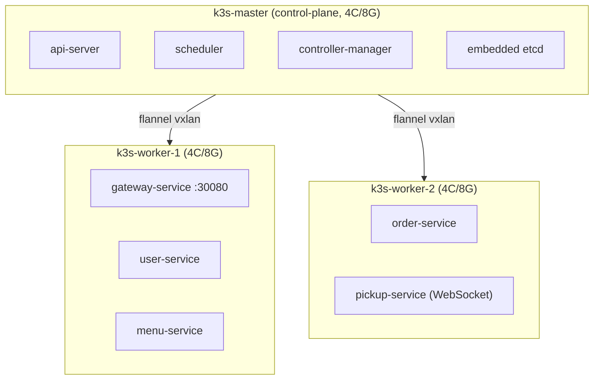
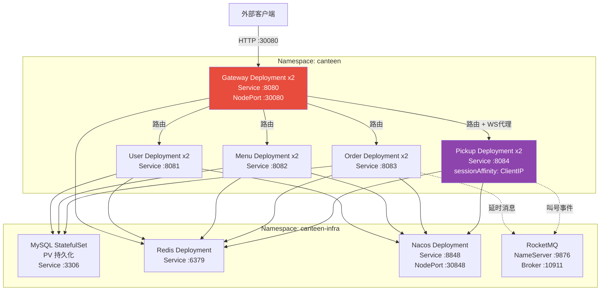
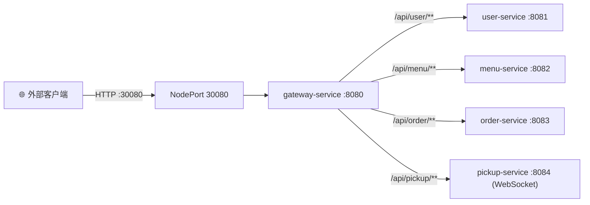
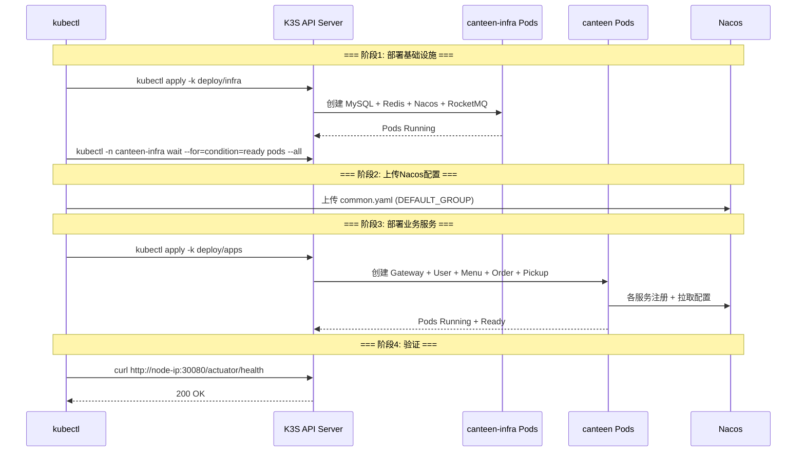

# K3S 部署方案说明

| 项目 | 内容 |
| --- | --- |
| 项目名称 | 智能食堂点餐与取餐微服务系统 |
| 文档版本 | v1.0 |
| 编写日期 | 2026-05-21 |
| 编写人 | 高祥雨 |

---

## 1 概述

本文档详细说明智能食堂系统在 K3S 集群上的部署方案，包括集群拓扑、安装步骤、资源清单说明、配置步骤和运行验证。

---

## 2 集群拓扑



- 禁用内置 Traefik，统一通过 `gateway-service` 的 NodePort 30080 对外暴露
- 命名空间：`canteen`（业务）、`canteen-infra`（基础设施）

---

## 3 安装步骤

### 3.1 Master 节点安装

```bash
# 1. 安装 K3S master（禁用 traefik，开放 kubeconfig 读取权限）
curl -sfL https://get.k3s.io | INSTALL_K3S_EXEC="--disable=traefik --write-kubeconfig-mode=644" sh -

# 2. 等待 master 就绪
sudo systemctl status k3s

# 3. 记下 node-token（worker 加入需要）
sudo cat /var/lib/rancher/k3s/server/node-token
```

### 3.2 Worker 节点加入

```bash
# 在每个 worker 节点上执行
curl -sfL https://get.k3s.io | K3S_URL=https://<master-ip>:6443 K3S_TOKEN=<node-token> sh -
```

### 3.3 本地 kubectl 配置

```bash
# 从 master 拷贝 kubeconfig
scp master:/etc/rancher/k3s/k3s.yaml ~/.kube/config

# 修改 server 地址为 master IP
sed -i 's/127.0.0.1/<master-ip>/' ~/.kube/config

# 验证
kubectl get nodes
```

---

## 4 部署基础设施

### 4.1 部署命令

```bash
kubectl apply -k deploy/infra
```

### 4.2 基础设施资源清单

| 文件 | 资源 | 说明 |
| --- | --- | --- |
| `namespace.yaml` | Namespace: canteen, canteen-infra | 业务和基础设施隔离 |
| `mysql-statefulset.yaml` | StatefulSet + PVC + ConfigMap + Service | MySQL 8.0, 3 个 schema, 持久化存储 |
| `redis-deployment.yaml` | Deployment + Service | Redis 7.x, 无持久化（缓存用） |
| `nacos-deployment.yaml` | Deployment + Service | Nacos 2.3.x standalone |
| `rocketmq-deployment.yaml` | NameServer + Broker Deployment + Service | RocketMQ 5.x |

### 4.3 MySQL 初始化

MySQL 使用 InitDB ConfigMap 自动初始化 3 个数据库：

- `canteen_user`
- `canteen_menu`
- `canteen_order`

初始化 SQL 脚本位于 `scripts/init-db.sql`，包含表结构和测试数据。

### 4.4 等待基础设施就绪

```bash
kubectl -n canteen-infra get pods -w
# 等待所有 Pod 状态为 Running/Ready
```

---

## 5 部署业务服务

### 5.1 构建与推送镜像

```bash
# 编译
cd canteen-backend
mvn clean package -DskipTests

# 构建镜像并推送（每个服务）
docker build -t registry.local/canteen/gateway-service:1.0.0 ./canteen-gateway
docker build -t registry.local/canteen/user-service:1.0.0 ./canteen-user
docker build -t registry.local/canteen/menu-service:1.0.0 ./canteen-menu
docker build -t registry.local/canteen/order-service:1.0.0 ./canteen-order
docker build -t registry.local/canteen/pickup-service:1.0.0 ./canteen-pickup
```

### 5.2 部署命令

```bash
kubectl apply -k deploy/apps
```

### 5.3 业务服务资源清单

| 文件 | 资源 | 说明 |
| --- | --- | --- |
| `configmap-common.yaml` | ConfigMap: common-config | Nacos / MySQL / Redis / RocketMQ 地址等公共配置（**不再包含敏感字段**） |
| `secrets.yaml` | Secret: db-secret + app-secret | DB 密码 + JWT secret + internal token，部署前必须替换 `REPLACE_ME_*` 占位 |
| `gateway.yaml` | Deployment + Service(NodePort) | 端口 8080, NodePort 30080 |
| `user.yaml` | Deployment + Service | 端口 8081, ClusterIP |
| `menu.yaml` | Deployment + Service | 端口 8082, ClusterIP |
| `order.yaml` | Deployment + Service | 端口 8083, ClusterIP |
| `pickup.yaml` | Deployment + Service | 端口 8084, sessionAffinity: ClientIP |

> **生成强随机 secret**：
> ```bash
> openssl rand -base64 48 | tr -d '\n'   # 用于 jwt-secret（≥256 bits）
> openssl rand -hex 32                    # 用于 internal-token
> ```
> 替换 `deploy/apps/secrets.yaml` 中的占位值后再 `kubectl apply`。



---

## 6 标签与选择器

### 6.1 标签约定

| Label 键 | 值示例 | 用途 |
| --- | --- | --- |
| `app` | `user-service` | Service selector 匹配 |
| `tier` | `business` / `infra` | HPA/监控分组 |
| `version` | `1.0.0` | 版本标识 |

### 6.2 选择器使用

每个 Service 的 `selector.matchLabels` 仅使用 `app` 标签，确保精准匹配对应的 Deployment Pod。

```yaml
selector:
  matchLabels:
    app: user-service
```

---

## 7 端口与服务矩阵

| 组件 | 容器端口 | 集群内 Service | 对外暴露 |
| --- | --- | --- | --- |
| gateway | 8080 | :8080 | NodePort :30080 |
| user | 8081 | :8081 | 不暴露 |
| menu | 8082 | :8082 | 不暴露 |
| order | 8083 | :8083 | 不暴露 |
| pickup | 8084 (HTTP+WS) | :8084 | 不暴露（经网关） |
| nacos | 8848/9848 | :8848 | NodePort :30848（仅调试） |
| mysql | 3306 | :3306 | 不暴露 |
| redis | 6379 | :6379 | 不暴露 |
| rocketmq-nameserver | 9876 | :9876 | 不暴露 |
| rocketmq-broker | 10911 | :10911 | 不暴露 |




---

## 8 关键配置说明

### 8.1 pickup-service WebSocket 粘连

```yaml
apiVersion: v1
kind: Service
metadata:
  name: pickup-service
  namespace: canteen
spec:
  selector:
    app: pickup-service
  sessionAffinity: ClientIP
  sessionAffinityConfig:
    clientIP:
      timeoutSeconds: 10800  # 3小时，保证 WS 长连接稳定
  ports:
    - port: 8084
      targetPort: 8084
```

### 8.2 gateway NodePort 暴露

```yaml
apiVersion: v1
kind: Service
metadata:
  name: gateway-service
  namespace: canteen
spec:
  type: NodePort
  selector:
    app: gateway-service
  ports:
    - name: http
      port: 8080
      targetPort: 8080
      nodePort: 30080
```

### 8.3 健康检查

所有业务服务配置了 `readinessProbe` 和 `livenessProbe`：

```yaml
readinessProbe:
  httpGet:
    path: /actuator/health/readiness
    port: 8081
  initialDelaySeconds: 20
  periodSeconds: 5
livenessProbe:
  httpGet:
    path: /actuator/health/liveness
    port: 8081
  initialDelaySeconds: 40
  periodSeconds: 10
```



---

## 9 运行验证

### 9.1 检查所有 Pod 状态

```bash
# 基础设施
kubectl -n canteen-infra get pods

# 业务服务
kubectl -n canteen get pods

# 期望: 所有 Pod 状态为 Running, READY 为 1/1
```

### 9.2 端到端冒烟测试

```bash
# 设置网关地址
export GW=http://<node-ip>:30080

# 1. 注册
curl -s -X POST $GW/api/user/auth/register \
  -H "Content-Type: application/json" \
  -d '{"phone":"13800138001","password":"Test1234","nickname":"测试用户"}' | jq .

# 2. 登录
TOKEN=$(curl -s -X POST $GW/api/user/auth/login \
  -H "Content-Type: application/json" \
  -d '{"phone":"13800138001","loginType":"password","password":"Test1234"}' | jq -r '.data.accessToken')

# 3. 查询菜品
curl -s -H "Authorization: Bearer $TOKEN" $GW/api/menu/dishes | jq .

# 4. 下单
curl -s -X POST -H "Authorization: Bearer $TOKEN" \
  -H "Content-Type: application/json" \
  -H "Idempotency-Key: test-001" \
  -d '{"merchantId":1,"items":[{"dishId":1,"quantity":2}]}' \
  $GW/api/order/orders | jq .

# 5. 查看日志
kubectl -n canteen logs -f deploy/order-service
```

### 9.3 常见问题排查

| 问题 | 排查命令 | 可能原因 |
| --- | --- | --- |
| Pod 不在 Running | `kubectl describe pod <name> -n canteen` | 镜像拉取失败/资源不足 |
| 服务间调用失败 | `kubectl logs <pod> -n canteen` | Nacos 注册异常/网络策略 |
| 数据库连接失败 | `kubectl logs <pod> -n canteen-infra` | MySQL 未就绪/密码错误 |
| WebSocket 连不上 | `kubectl get svc -n canteen` | sessionAffinity 配置缺失 |
