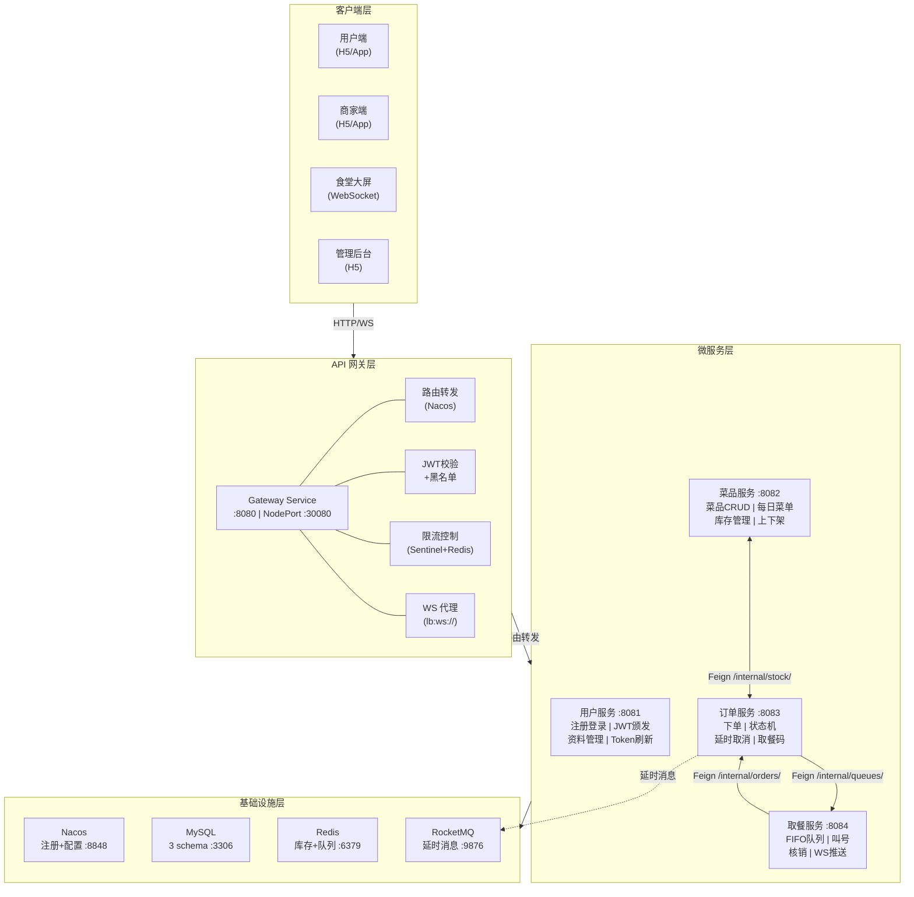
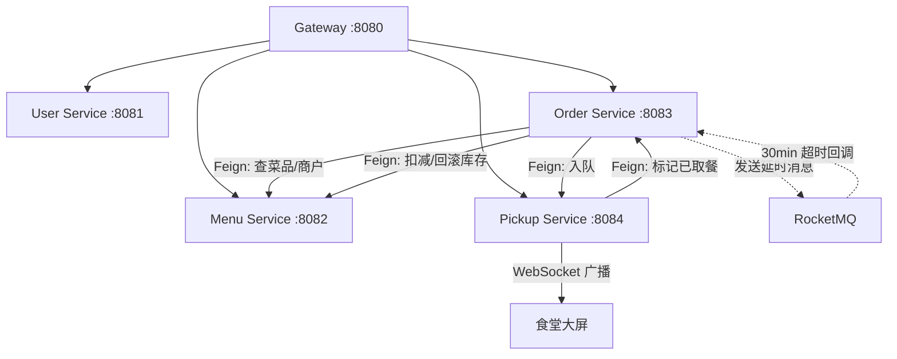
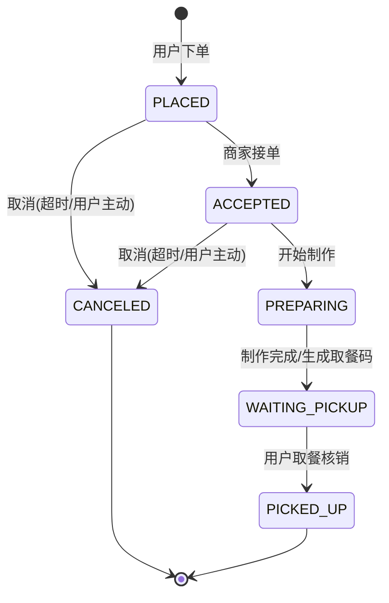
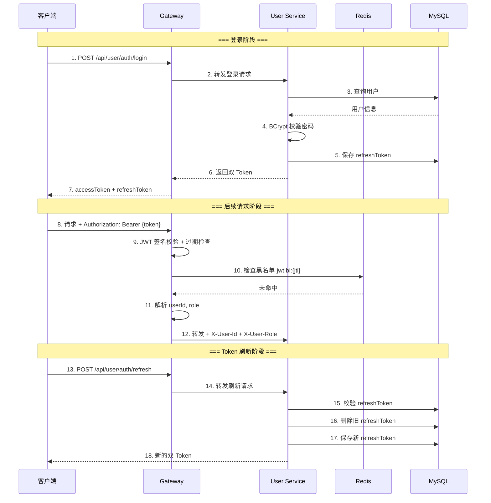
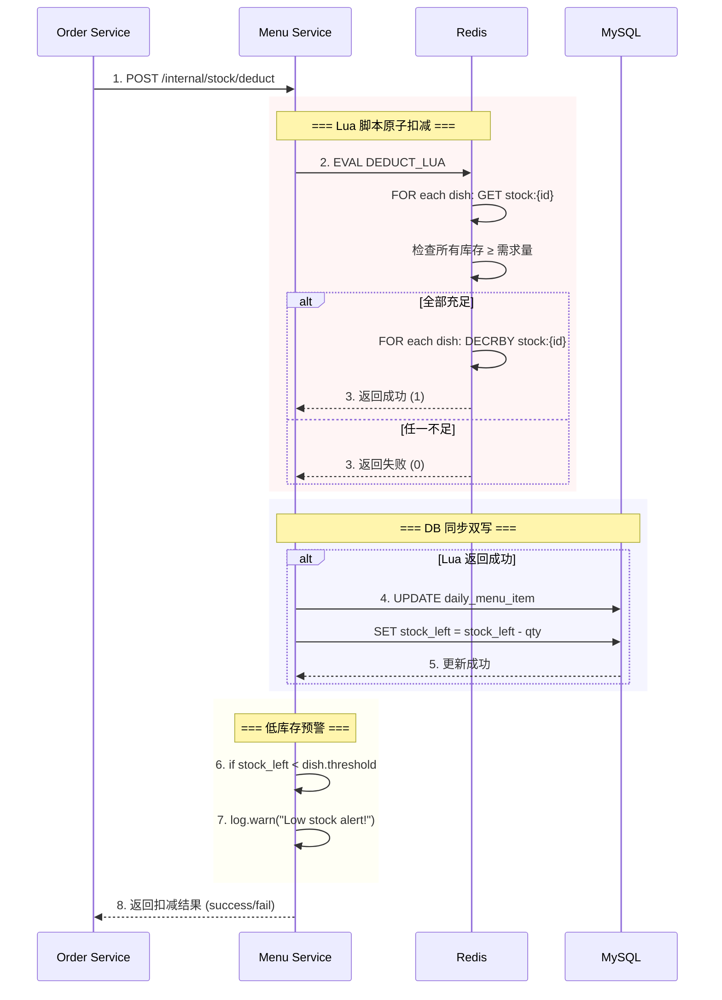
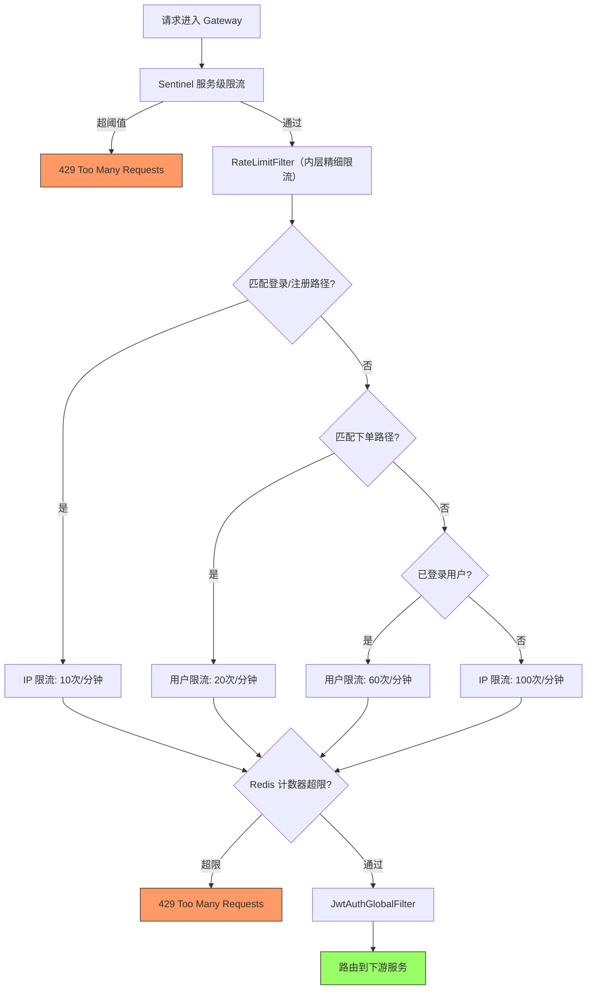
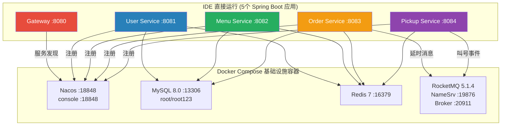
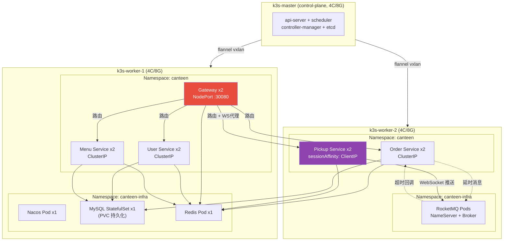

# 架构设计文档

| 项目 | 内容 |
| --- | --- |
| 项目名称 | 智能食堂点餐与取餐微服务系统 |
| 文档版本 | v2.0 |
| 编写日期 | 2026-05-21 |
| 修订日期 | 2026-06-15 |
| 编写人 | 高祥雨

---

## 1 系统概述

### 1.1 项目定位

面向校园/园区的智能食堂系统，支持用户在线点餐、商家接单备餐、用户扫码/取餐码取餐、食堂大屏实时显示取餐队列。采用 Spring Cloud Alibaba 微服务架构，部署于 K3S 集群。

### 1.2 核心设计目标

| 目标 | 描述 |
| --- | --- |
| **高内聚低耦合** | 按领域边界拆分为 5 个独立微服务，各自拥有独立数据库 |
| **弹性伸缩** | 无状态服务 + Redis 外置状态，支持 K3S HPA 水平扩容 |
| **高可用** | 服务隔离 + 网关统一异常处理 + Sentinel 熔断降级 |
| **可观测** | TraceId 全链路追踪 + 统一日志 + Actuator 健康检查 |
| **安全可靠** | JWT 双 Token + Redis 黑名单 + BCrypt 密码加密 + 内部 Token 隔离 |

### 1.3 设计原则

| 原则 | 说明 | 实践 |
| --- | --- | --- |
| 单一职责 | 每个服务只负责一个业务领域 | 用户/菜品/订单/取餐 各自独立 |
| 接口隔离 | 服务间通过 Feign 接口通信 | /internal/** 内部接口 |
| 依赖倒置 | 服务间依赖抽象 Feign 接口 | 接口定义在使用方 |
| 数据去中心化 | 每个服务独立数据库 | 3 个 MySQL schema + Redis 状态 |
| 故障隔离 | 单个服务故障不影响整体 | 网关统一异常 + Sentinel 熔断 |

---

## 2 技术选型

### 2.1 技术栈总览

| 分类 | 组件 | 版本 | 选型理由 |
| --- | --- | --- | --- |
| **语言** | Java | 17 LTS | 长期支持版本，生态成熟 |
| **框架** | Spring Boot | 3.2.5 | 业界标准微服务框架 |
| **微服务** | Spring Cloud | 2023.0.1 | 与 Boot 3.2 版本对齐 |
| **微服务** | Spring Cloud Alibaba | 2023.0.1.0 | 国产微服务解决方案 |
| **注册/配置** | Nacos | 2.3.2 | 同时支持服务发现和配置管理 |
| **网关** | Spring Cloud Gateway | 4.x | 响应式网关，支持 WebSocket 代理 |
| **限流熔断** | Sentinel | 1.8.x | 可视化控制台，规则持久化 |
| **服务调用** | OpenFeign | - | 声明式 HTTP 客户端 |
| **负载均衡** | Spring Cloud LoadBalancer | - | 替代 Ribbon，响应式支持 |
| **消息队列** | RocketMQ | 5.1.4 | 支持延时消息（订单超时场景） |
| **数据库** | MySQL | 8.0 | 关系型数据库，支持事务 |
| **ORM** | MyBatis-Plus | 3.5.5 | 增强 MyBatis，减少样板代码 |
| **缓存** | Redis | 7.x | 高性能缓存，支持 Lua 脚本 |
| **Redis 客户端** | Lettuce + Redisson | - | 响应式 + 分布式锁 |
| **认证** | JJWT | 0.12.5 | JWT 生成和校验 |
| **工具库** | Hutool | 5.8.25 | 通用工具类 |
| **对象映射** | MapStruct | 1.5.5 | 编译期生成映射代码 |
| **部署** | K3S + Docker | 1.28+ | 轻量级 Kubernetes |
| **测试** | JUnit 5 + Mockito | - | 单元测试 |
| **测试** | Testcontainers | 1.19.6 | 集成测试容器化 |

### 2.2 技术选型决策理由

#### 为什么选择 Nacos 而不是 Eureka？

1. Nacos 同时支持服务发现和配置管理，减少组件数量
2. Nacos 支持健康检查方式更灵活（临时实例 + 持久实例）
3. Nacos CAP 模型支持 AP/CP 切换
4. Spring Cloud Alibaba 官方推荐

#### 为什么选择 RocketMQ 而不是 RabbitMQ/Kafka？

1. RocketMQ 原生支持延时消息（订单超时取消场景的核心需求）
2. 阿里系技术栈一致性好
3. 事务消息支持（未来可扩展支付场景）

#### 为什么选择 Redis Lua 脚本而不是分布式锁扣库存？

1. Lua 脚本在 Redis 服务端原子执行，性能更高
2. 避免分布式锁的获取/释放开销
3. 批量扣减多个菜品库存时，单次 Lua 调用保证原子性

---

## 3 软件架构图

> **图表渲染说明**：本文档使用 Mermaid 语法绘制架构图。推荐使用以下工具查看：
> - **VS Code**：安装 "Markdown Preview Mermaid Support" 插件
> - **IntelliJ IDEA**：内置 Mermaid 支持（Markdown 预览）
> - **GitHub / GitLab**：原生支持 Mermaid 渲染
> - **Typora**：原生支持
> - **在线渲染**：复制代码块到 [Mermaid Live Editor](https://mermaid.live)
>
> 若当前阅读器不支持 Mermaid，请参考下方 ASCII 备选图。

### 3.1 系统总体架构图



### 3.2 服务间调用关系图



### 3.3 订单状态机图



---

## 4 微服务详细设计

### 4.1 服务清单

| 服务 | 端口 | K8s Service 类型 | 数据库 | Redis 用途 |
| --- | --- | --- | --- | --- |
| gateway-service | 8080 | NodePort :30080 | - | 限流计数 + JWT 黑名单查询 |
| user-service | 8081 | ClusterIP | canteen_user | JWT 黑名单写入（登出时） |
| menu-service | 8082 | ClusterIP | canteen_menu | 库存缓存（Lua 原子扣减）+ 双写 DB |
| order-service | 8083 | ClusterIP | canteen_order | 幂等键（SETNX）+ 取餐码序列（INCR） |
| pickup-service | 8084 | ClusterIP (sessionAffinity) | 仅 Redis | 队列 + 当前叫号 + 历史 + 反向索引 |

### 4.2 common 模块共享设计

`canteen-common` 模块作为所有服务的共享依赖，提供：

| 类 | 职责 |
| --- | --- |
| `Result<T>` | 统一响应体：code, message, data, traceId |
| `ResultCode` | 错误码枚举（按领域分段：10xxx/20xxx/30xxx/40xxx/50xxx） |
| `BusinessException` | 业务异常，携带 ResultCode |
| `GlobalExceptionHandler` | 全局异常处理，统一返回 Result 格式 |
| `JwtTokenProvider` | JWT 生成、校验、解析 |
| `TraceIdFilter` | Servlet Filter，生成/透传 X-Trace-Id 到 MDC |
| `RedisConfig` | Redis 序列化配置（Jackson2JsonRedisSerializer） |
| `RedissonConfig` | Redisson 客户端配置 |
| `InternalTokenInterceptor` | Feign 请求拦截器，自动注入 X-Internal-Token |

---

## 5 关键技术方案

### 5.1 身份认证方案



**Token 设计**：

| 属性 | Access Token | Refresh Token |
| --- | --- | --- |
| 有效期 | 15 分钟 | 7 天 |
| 算法 | HS256 | HS256 |
| Payload | sub=userId, jti=uuid, role="user" | sub=userId, jti=uuid, role="refresh" |
| 存储位置 | 客户端内存 | 数据库 refresh_token 表 |
| 吊销方式 | Redis 黑名单（登出时） | 删除数据库记录 |

### 5.2 库存扣减方案

采用 **Redis Lua 脚本原子扣减 + DB 同步双写** 方案：



**Lua 脚本**：

```lua
-- KEYS[i] = stock:{dishId}
-- ARGV[i] = quantity
for i = 1, #KEYS do
  local left = tonumber(redis.call(''GET'', KEYS[i]))
  if not left or left < tonumber(ARGV[i]) then return 0 end
end
for i = 1, #KEYS do
  redis.call(''DECRBY'', KEYS[i], ARGV[i])
end
return 1
```

### 5.3 限流方案

双层限流架构：

| 层级 | 组件 | 维度 | 粒度 | 目的 |
| --- | --- | --- | --- | --- |
| 外层 | Sentinel | 按路由 ID | 服务级 QPS | 全局保护伞 |
| 内层 | Redis 计数器 | IP/用户/接口 | 业务级精细控制 | 防刷/防暴力破解 |



### 5.4 服务间通信方案

| 场景 | 通信方式 | 实现 |
| --- | --- | --- |
| 同步查询（下单时查菜品） | Feign 同步调用 | Order → Menu: GET /internal/dishes/{id} |
| 同步写操作（扣库存） | Feign 同步调用 | Order → Menu: POST /internal/stock/deduct |
| 异步延时（超时取消） | RocketMQ 延时消息 | Order → MQ → OrderTimeoutListener |
| 实时推送（大屏叫号） | WebSocket STOMP | Pickup → WS → Browser |

### 5.5 TraceId 全链路追踪方案

```mermaid
flowchart LR
    subgraph 客户端
        A["请求 (X-Trace-Id: 无)"]
    end

    subgraph Gateway
        B["TraceIdGlobalFilter"]
        B1["生成 UUID → 注入 MDC"]
    end

    subgraph Service1["下游服务 A"]
        C["TraceIdFilter"]
        C1["读取 X-Trace-Id → 注入 MDC"]
    end

    subgraph FeignCall["Feign 调用"]
        D["InternalTokenInterceptor"]
        D1["透传 X-Trace-Id 到请求头"]
    end

    subgraph Service2["下游服务 B"]
        E["TraceIdFilter"]
        E1["读取 X-Trace-Id → 注入 MDC"]
    end

    A -->|"HTTP"| B
    B --> B1
    B1 -->|"透传 X-Trace-Id Header"| C
    C --> C1
    C1 -->|"业务处理"| D
    D --> D1
    D1 -->|"透传 X-Trace-Id Header"| E
    E --> E1

    E1 --> F["日志输出: [traceId=xxx] message"]
    
    style F fill:#9f6,stroke:#333
```



---

## 6 部署架构

### 6.1 本地开发环境



### 6.2 K3S 生产环境



---

## 7 安全架构

### 7.1 安全层次

| 层次 | 安全措施 |
| --- | --- |
| 传输层 | JWT HS256 签名，内部服务 X-Internal-Token |
| 网关层 | JWT 校验 + 黑名单 + 四级限流 |
| 服务层 | BCrypt 密码加密 (cost=10)，refreshToken 轮转 |
| 数据层 | 参数化查询防 SQL 注入，@Valid 输入校验 |
| 运维层 | K3s Secret 管理敏感配置，仓库不含可用默认值 |

### 7.2 敏感配置管理

| 配置项 | 开发环境 | 生产环境来源 |
| --- | --- | --- |
| jwt.secret | application.yaml 占位值 | K3s Secret / Nacos 配置 |
| internal.token | application.yaml 占位值 | K3s Secret / Nacos 配置 |
| 数据库密码 | docker-compose 环境变量 | K3s Secret |
| Redis 密码 | 无（本地开发） | K3s Secret |

---

## 8 附录

### 8.1 统一错误码表

| code | 枚举值 | 含义 |
| --- | --- | --- |
| 0 | SUCCESS | 操作成功 |
| 90000 | UNKNOWN_ERROR | 系统内部错误 |
| 10001 | USER_ALREADY_EXISTS | 账号已存在 |
| 10002 | USER_PASSWORD_ERROR | 密码错误 |
| 10003 | USER_TOKEN_INVALID | Token 无效或已过期 |
| 10004 | USER_TOKEN_EXPIRED | Token 已过期 |
| 10005 | USER_NOT_FOUND | 用户不存在 |
| 10006 | USER_PHONE_EXISTS | 手机号已注册 |
| 10007 | USER_VERIFY_CODE_ERROR | 验证码错误 |
| 10008 | USER_DISABLED | 账号已被禁用 |
| 20001 | MENU_STOCK_INSUFFICIENT | 库存不足 |
| 20002 | MENU_DISH_OFF_SHELF | 菜品已下架 |
| 20003 | MENU_DISH_NOT_FOUND | 菜品不存在 |
| 20004 | MENU_ALREADY_PUBLISHED | 今日菜单已发布 |
| 20005 | MENU_MERCHANT_NOT_FOUND | 商户不存在 |
| 30001 | ORDER_STATUS_ILLEGAL | 订单状态非法 |
| 30002 | ORDER_EXPIRED | 订单已过期 |
| 30003 | ORDER_NOT_FOUND | 订单不存在 |
| 30004 | ORDER_CANNOT_CANCEL | 不可取消 |
| 30005 | ORDER_IDEMPOTENT_DUPLICATE | 重复请求 |
| 40001 | PICKUP_CODE_NOT_FOUND | 取餐码不存在 |
| 40002 | PICKUP_ALREADY_VERIFIED | 重复核销 |
| 40003 | PICKUP_QUEUE_EMPTY | 队列为空 |
| 50001 | GATEWAY_RATE_LIMITED | 请求过于频繁 |
| 50002 | GATEWAY_AUTH_FAILED | 鉴权失败 |
| 50003 | GATEWAY_SERVICE_UNAVAILABLE | 服务暂不可用 |

### 8.2 修订历史

| 版本 | 日期 | 修订内容 |
| --- | --- | --- |
| v1.0 | 2026-05-21 | 初稿 |
| v1.1 | 2026-05-23 | 补充架构图、状态机图、时序图 |
| v2.0 | 2026-06-15 | 新增 ASCII 备选图、技术决策理由、安全架构、限流架构、TraceId 方案 |
