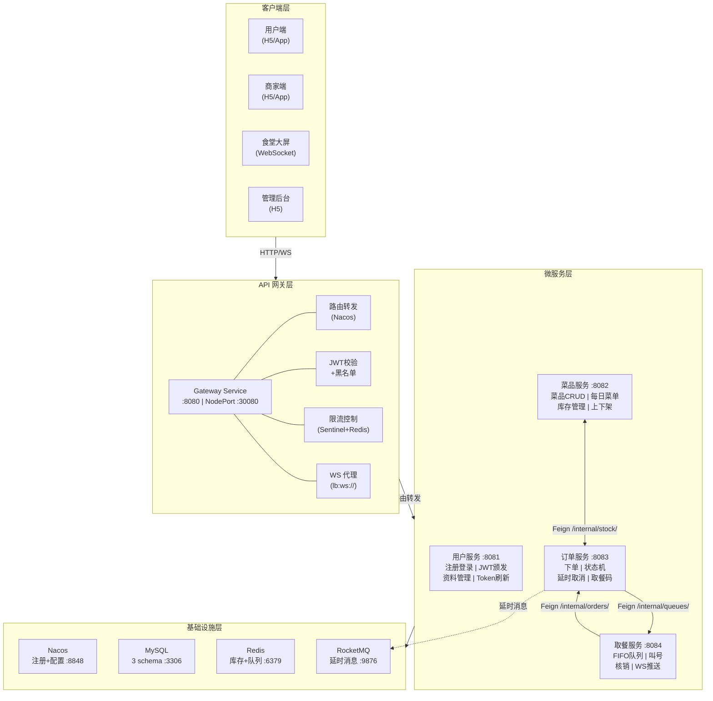
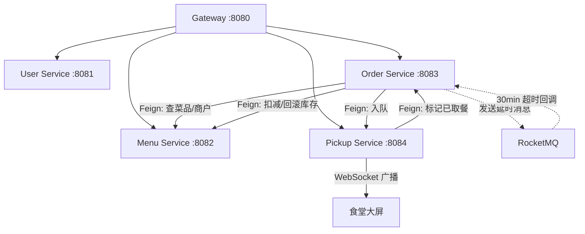
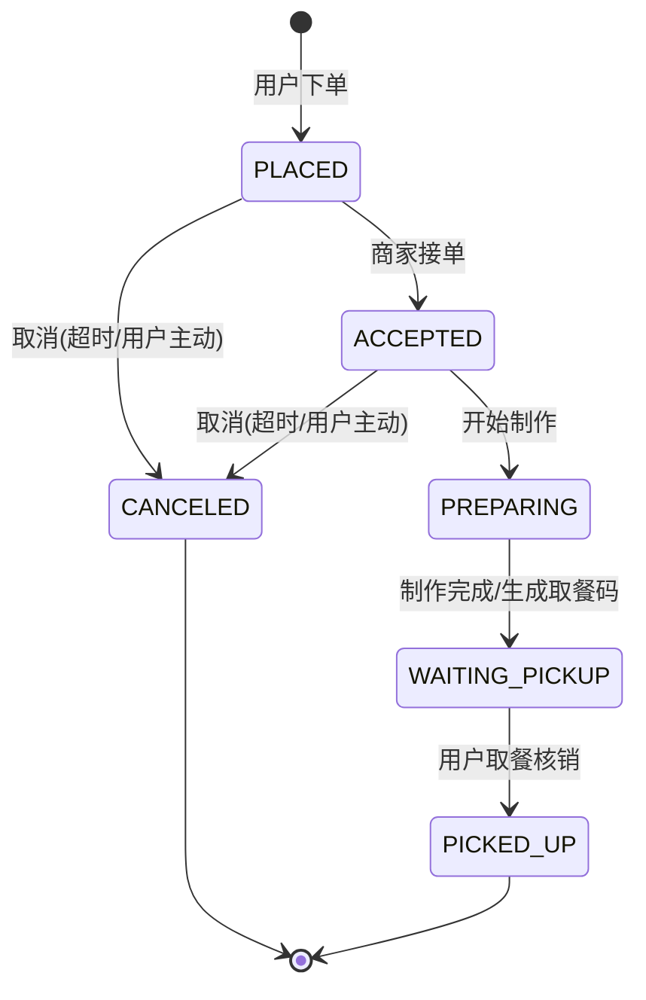
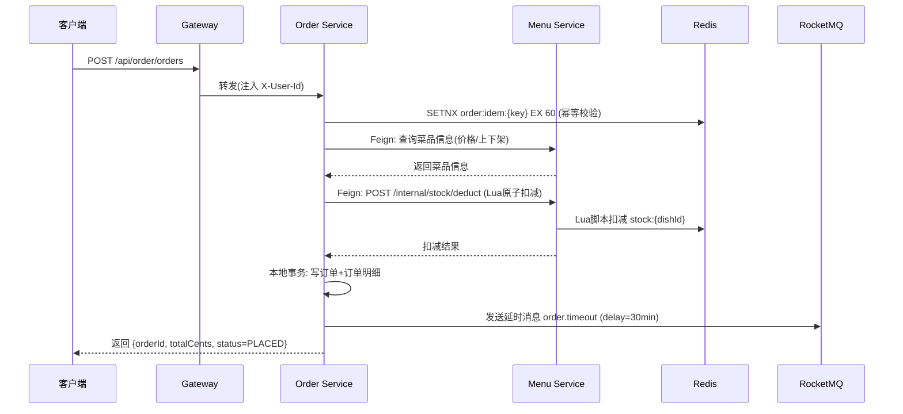
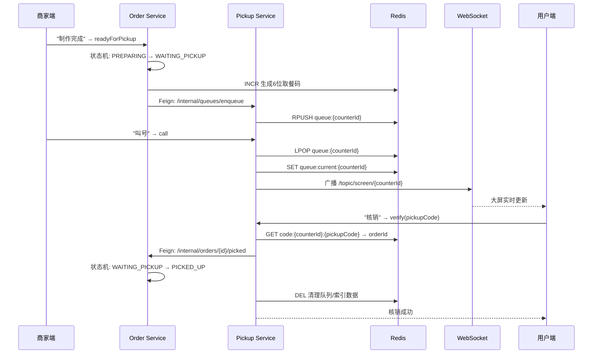
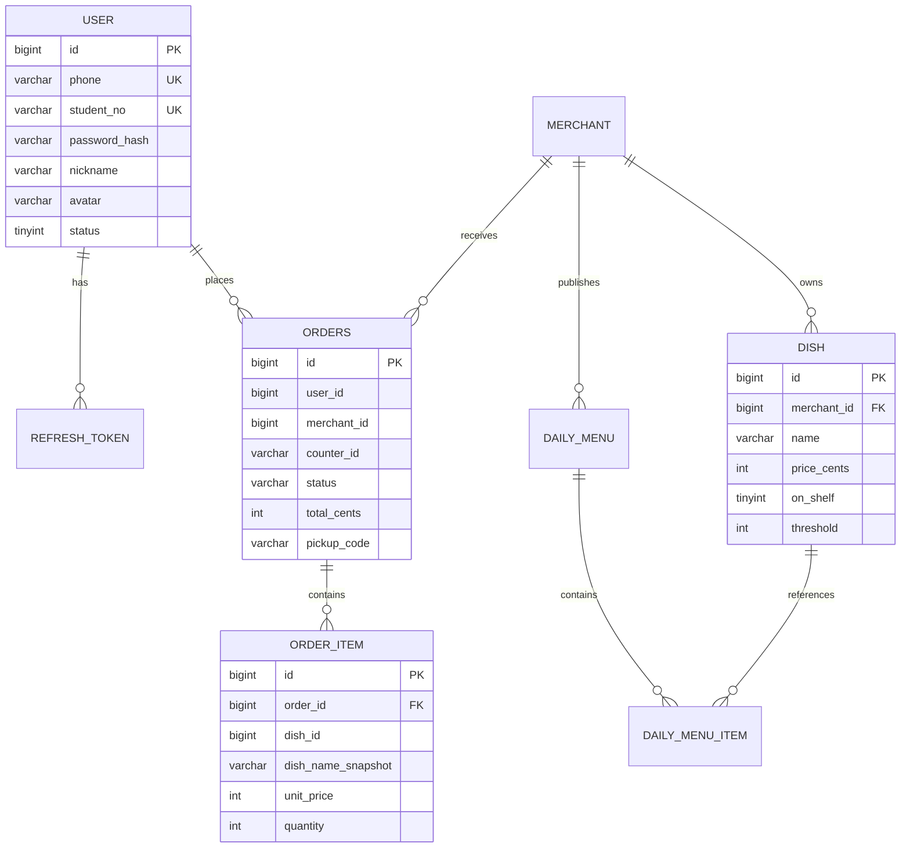

# 架构设计文档

| 项目 | 内容 |
| --- | --- |
| 项目名称 | 智能食堂点餐与取餐微服务系统 |
| 文档版本 | v1.1 |
| 编写日期 | 2026-05-21 |
| 修订日期 | 2026-05-23 |

---

## 1 系统概述

面向校园/园区的智能食堂系统，支持用户在线点餐、商家接单备餐、用户扫码/取餐码取餐、食堂大屏实时显示取餐队列。采用 Spring Cloud Alibaba 微服务架构，部署于 K3S 集群。

---

## 2 技术选型

| 分类 | 组件 | 版本 | 备注 |
| --- | --- | --- | --- |
| 语言框架 | Java 17 + Spring Boot | 3.2.x | LTS |
| 微服务套件 | Spring Cloud + SCA | 2023.0.x | 与 Boot 3.2 对齐 |
| 注册/配置 | Nacos | 2.3.x | standalone |
| 网关 | Spring Cloud Gateway (reactive) | 4.x | 原生 WS 代理 |
| 限流熔断 | Sentinel | 1.8.x | 规则持久化到 Nacos |
| 服务调用 | OpenFeign | - | 同步主链路 |
| 消息 | RocketMQ | 5.x | 延时消息 + 广播 |
| 持久化 | MySQL | 8.0 | 一服务一 schema |
| 缓存 | Redis | 7.x | 库存 + 队列 + JWT 黑名单 |
| 认证 | JWT (HS256) | - | 双 Token + Redis 黑名单 |
| 部署 | K3S | 1.28+ | 单 master + 2 worker |

---

## 3 软件架构图

### 3.1 系统总体架构图

### 3.2 服务间调用关系图

### 3.3 订单状态机图

---

## 4 微服务划分

| 服务 | 端口 | 职责 | 数据库 | Redis 用途 |
| --- | --- | --- | --- | --- |
| gateway-service | 8080 (NodePort 30080) | 路由、JWT、限流、WS 代理 | - | 限流计数 + JWT 黑名单 |
| user-service | 8081 | 注册登录、JWT、资料管理 | canteen_user | Token 黑名单 |
| menu-service | 8082 | 菜品CRUD、菜单发布、库存管理 | canteen_menu | 库存缓存(Lua原子扣减) |
| order-service | 8083 | 下单、状态机、延时取消、取餐码 | canteen_order | 幂等键 + 取餐码序列 |
| pickup-service | 8084 | FIFO队列、叫号、核销、WS推送 | 仅 Redis | 队列 + 反向索引 |

---

## 5 关键流程

### 5.1 下单流程

### 5.2 取餐流程

---

## 6 数据库设计

每个服务独立 schema，通过 ID 引用，不建外键。所有表默认带 `id BIGINT PK`、`created_at`、`updated_at`、`deleted_at`。

| Schema | 主要表 | 说明 |
| --- | --- | --- |
| canteen_user | `user`, `refresh_token` | 用户信息 + Token 记录 |
| canteen_menu | `merchant`, `dish`, `daily_menu`, `daily_menu_item` | 商户 + 菜品 + 每日菜单 |
| canteen_order | `orders`, `order_item` | 订单 + 订单明细 |
| (pickup) | 仅 Redis | 队列 + 反向索引 |

### 6.1 ER 图

---

## 7 非功能需求

| 类别 | 要求 | 实现方式 |
| --- | --- | --- |
| 性能 | 单节点 QPS ≥ 200, p95 ≤ 500ms | Redis Lua 原子操作 + 连接池 |
| 安全 | 密码 BCrypt + JWT 可吊销 + 内部 Token 隔离 | JwtTokenProvider + InternalTokenInterceptor |
| 可用性 | 任一服务宕机不影响其他 | 服务隔离 + 网关统一异常处理 |
| 可扩展 | 无状态可水平扩容 | Redis 外置状态 + K8s HPA |
| 可观测 | 日志统一 + 健康检查 | TraceId + Actuator + Prometheus |

---

## 8 统一错误码

| 分段 | 含义 |
| --- | --- |
| `0` | 成功 |
| `10xxx` | 用户域（10001 账号已存在, 10002 密码错误, 10003 Token无效或已过期, 10004 Token已过期, 10005 用户不存在, 10006 手机号已注册, 10007 验证码错误, 10008 账号已被禁用） |
| `20xxx` | 菜品域（20001 库存不足, 20002 菜品已下架, 20003 菜品不存在, 20004 今日菜单已发布, 20005 商户不存在） |
| `30xxx` | 订单域（30001 订单状态非法, 30002 订单已过期, 30003 订单不存在, 30004 订单当前状态不可取消, 30005 重复请求） |
| `40xxx` | 取餐域（40001 取餐码不存在, 40002 重复核销, 40003 队列为空） |
| `50xxx` | 网关/系统（50001 请求过于频繁, 50002 鉴权失败, 50003 服务暂不可用） |
| `90000` | 未知异常 |
