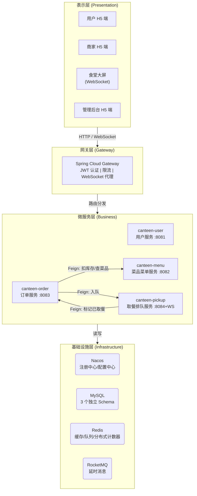
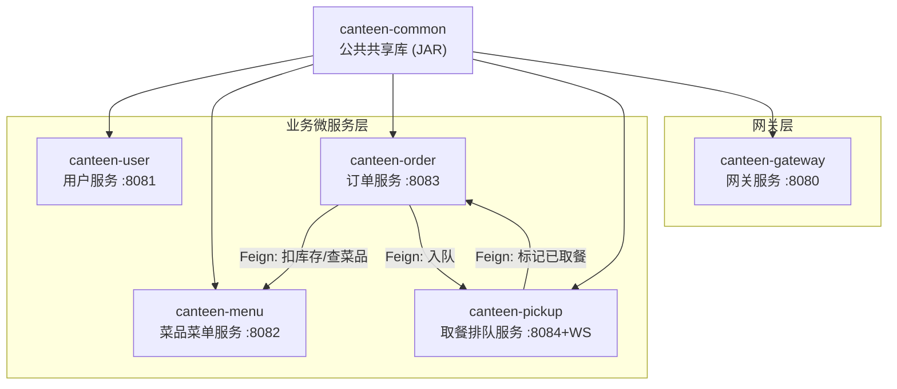
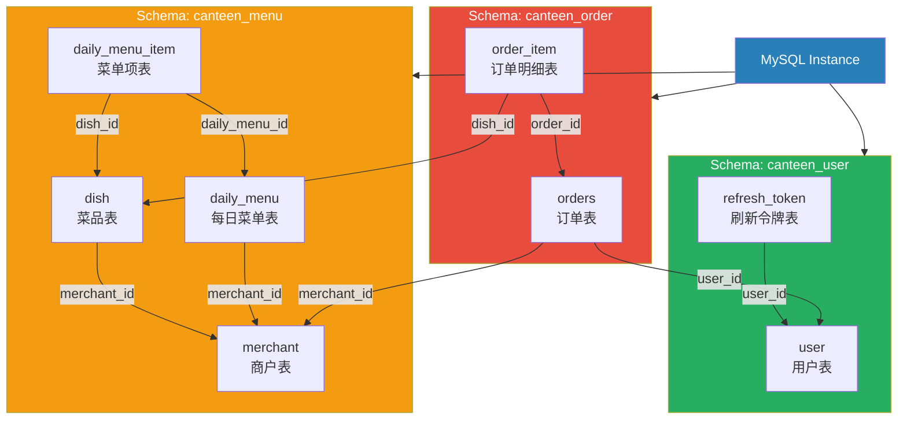
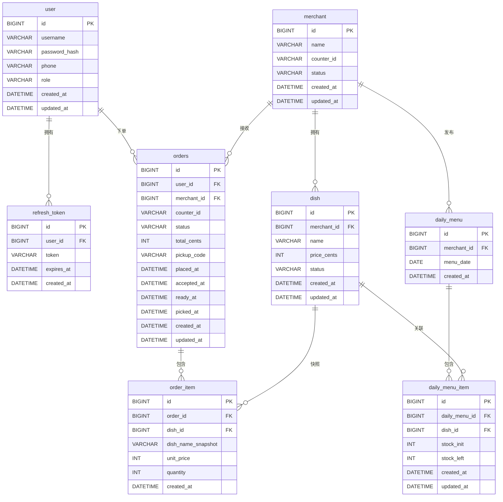
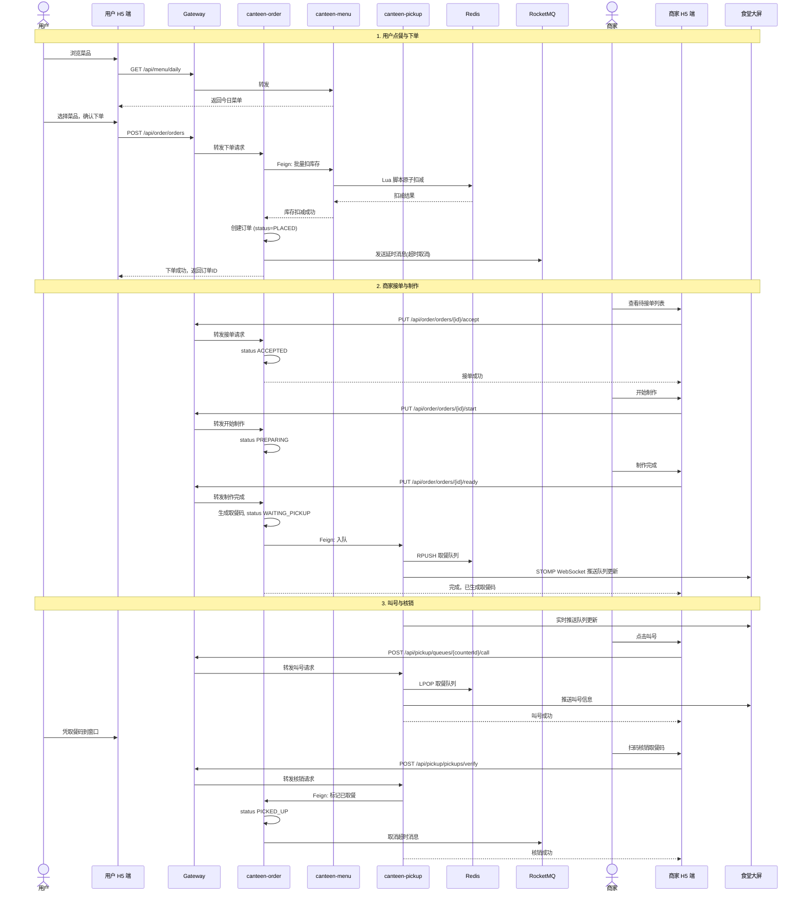
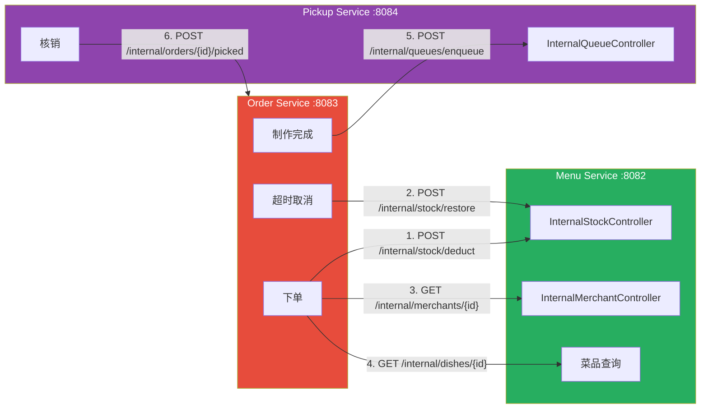
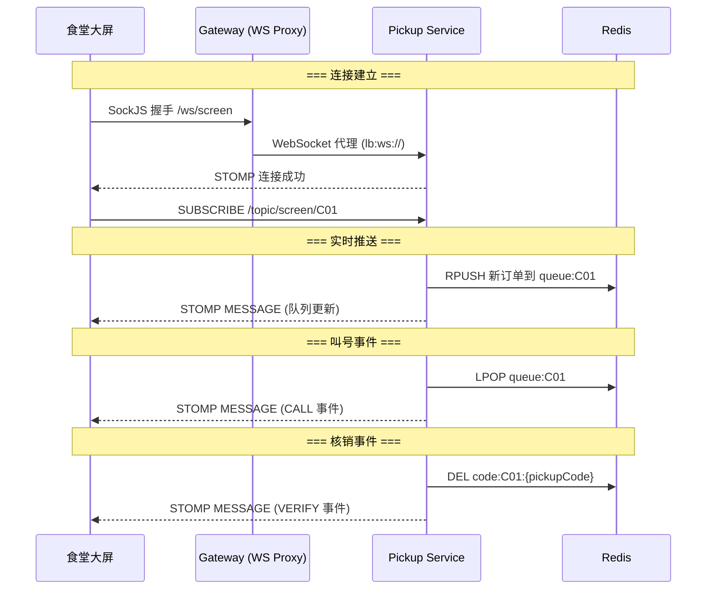

# 概要设计说明书

| 项目 | 内容 |
| --- | --- |
| 项目名称 | 智能食堂点餐与取餐微服务系统 |
| 文档版本 | v2.0 |
| 编写日期 | 2026-05-21 |
| 修订日期 | 2026-06-15 |
| 编写人 | 高祥雨

---

## 1 引言

### 1.1 编写目的

本文档是智能食堂点餐与取餐微服务系统的概要设计说明书，依据《需求规格说明书》编写，目的是：

1. 明确系统的总体结构和模块划分
2. 确定各子系统之间的关系和交互方式
3. 设计数据库的总体结构
4. 定义主要接口规范
5. 为详细设计和编码提供指导依据

### 1.2 适用范围

本文档适用于系统架构师、开发人员、测试人员和项目评审人员。

### 1.3 术语定义

| 术语 | 说明 |
| --- | --- |
| 微服务 | 一种架构风格，将应用拆分为一组小型、独立的服务 |
| 限界上下文 | DDD 中的领域边界，对应一个微服务的职责范围 |
| Feign | Spring Cloud 声明式 HTTP 客户端 |
| STOMP | 基于帧的流式消息协议，运行在 WebSocket 之上 |
| K3S | 轻量级 Kubernetes，适用于资源受限环境 |
| Lua 脚本 | Redis 服务器端执行的脚本语言，保证原子性 |

### 1.4 参考文档

- 《需求规格说明书》v2.0
- 《架构设计文档》v2.0
- Spring Cloud Alibaba 官方文档
- MyBatis-Plus 官方文档

---

## 2 系统总体架构

### 2.1 架构分层

系统采用经典的四层微服务架构：



> 注：本地开发 docker-compose.yaml 使用非标准端口以避免冲突 — Nacos 18848、MySQL 13306、Redis 16379、RocketMQ 19876。各服务 application.yaml 默认值已对应调整。

### 2.2 服务划分原则

| 原则 | 说明 | 实践 |
| --- | --- | --- |
| **领域驱动** | 按业务领域边界划分 | 用户域、菜品域、订单域、取餐域 |
| **数据独立性** | 每个服务拥有独立数据库 | 3 个 MySQL Schema + Redis 数据结构隔离 |
| **接口契约** | 服务间通过明确的 API 通信 | Feign 接口 + RESTful API |
| **故障隔离** | 服务故障不扩散 | 熔断降级 + 统一异常处理 |
| **独立部署** | 每个服务可独立构建和部署 | Dockerfile + K8s Deployment |

---

## 3 模块设计

### 3.1 模块总览

| 模块 | 类型 | 端口 | 依赖关系 |
| --- | --- | --- | --- |
| canteen-common | 共享库 (JAR) | - | 被所有业务服务依赖 |
| canteen-gateway | 网关服务 | 8080 | 依赖 Nacos；不依赖其他业务服务 |
| canteen-user | 业务服务 | 8081 | 依赖 common、MySQL、Redis |
| canteen-menu | 业务服务 | 8082 | 依赖 common、MySQL、Redis |
| canteen-order | 业务服务 | 8083 | 依赖 common、MySQL、Redis、RocketMQ；Feign 调用 menu/pickup |
| canteen-pickup | 业务服务 | 8084 | 依赖 common、Redis；Feign 调用 order |


### 3.2 公共模块 (canteen-common)

#### 3.2.1 模块职责

为所有业务服务提供共享的基础能力，避免代码重复。

#### 3.2.2 包结构

```
com.canteen.common
├── config
│   ├── RedisConfig.java          # Redis 序列化配置
│   ├── RedissonConfig.java       # Redisson 客户端配置
│   └── InternalTokenInterceptor.java  # Feign 拦截器
├── exception
│   ├── BusinessException.java    # 业务异常类
│   └── GlobalExceptionHandler.java   # 全局异常处理器
├── result
│   ├── Result.java               # 统一响应体
│   └── ResultCode.java           # 错误码枚举
└── util
    ├── JwtTokenProvider.java     # JWT 令牌提供者
    └── TraceIdFilter.java        # 链路追踪过滤器
```

#### 3.2.3 关键设计决策

| 决策 | 说明 |
| --- | --- |
| Result 泛型设计 | `Result<T>` 支持任意数据类型，统一响应格式 |
| ResultCode 枚举分段 | 10xxx 用户、20xxx 菜品、30xxx 订单、40xxx 取餐、50xxx 网关、90000 兜底 |
| BusinessException | 运行时异常，携带 ResultCode，由 GlobalExceptionHandler 统一处理 |
| Feign 拦截器 | 自动从配置文件读取 internal.token，注入 X-Internal-Token header |

---

### 3.3 用户服务 (canteen-user)

#### 3.3.1 模块职责

负责用户身份认证和用户资料管理。

#### 3.3.2 包结构

```
com.canteen.user
├── UserApplication.java
├── config
│   └── MybatisPlusConfig.java
├── controller
│   ├── AuthController.java       # 注册、登录、刷新、登出
│   └── UserController.java       # 资料查询、修改
├── dto
│   ├── LoginRequest.java         # 登录请求
│   ├── RegisterRequest.java      # 注册请求
│   ├── RefreshRequest.java       # 刷新请求
│   ├── TokenResponse.java        # Token 响应
│   ├── UserUpdateRequest.java    # 修改资料请求
│   └── UserVO.java               # 用户视图对象
├── entity
│   ├── User.java                 # 用户实体
│   └── RefreshToken.java         # 刷新令牌实体
├── mapper
│   ├── UserMapper.java           # 用户 Mapper
│   └── RefreshTokenMapper.java   # 刷新令牌 Mapper
└── service
    ├── AuthService.java          # 认证服务
    └── UserProfileService.java   # 资料服务
```

#### 3.3.3 数据表

| 表名 | 说明 | 主要字段 |
| --- | --- | --- |
| user | 用户表 | id, phone, student_no, password_hash, nickname, avatar, status |
| refresh_token | 刷新令牌表 | id, user_id, token_jti, expires_at |

---

### 3.4 菜品菜单服务 (canteen-menu)

#### 3.4.1 模块职责

管理菜品信息、每日菜单发布、库存管理和上下架控制。

#### 3.4.2 包结构

```
com.canteen.menu
├── MenuApplication.java
├── config
│   └── MybatisPlusConfig.java
├── controller
│   ├── DishController.java          # 菜品 CRUD + 上下架
│   ├── DailyMenuController.java     # 每日菜单发布/查询
│   ├── InternalStockController.java # 内部: 库存扣减/回滚 (Feign)
│   └── InternalMerchantController.java # 内部: 商户/菜品查询 (Feign)
├── dto
│   ├── DishCreateRequest.java       # 创建菜品
│   ├── DishVO.java                  # 菜品视图
│   ├── DailyMenuPublishRequest.java # 发布菜单
│   ├── DailyMenuVO.java            # 菜单视图
│   └── StockDeductRequest.java     # 库存操作请求
├── entity
│   ├── Merchant.java               # 商户实体
│   ├── Dish.java                   # 菜品实体
│   ├── DailyMenu.java              # 每日菜单实体
│   └── DailyMenuItem.java          # 菜单项实体
├── mapper
│   ├── MerchantMapper.java
│   ├── DishMapper.java
│   ├── DailyMenuMapper.java
│   └── DailyMenuItemMapper.java
└── service
    ├── DishService.java            # 菜品服务
    ├── DailyMenuService.java       # 菜单服务
    └── StockService.java           # 库存服务 (Lua 脚本)
```

#### 3.4.3 数据表

| 表名 | 说明 | 主要字段 |
| --- | --- | --- |
| merchant | 商户表 | id, name, counter_id |
| dish | 菜品表 | id, merchant_id, name, price_cents, image_url, on_shelf, threshold |
| daily_menu | 每日菜单表 | id, merchant_id, biz_date, sell_start, sell_end |
| daily_menu_item | 菜单项表 | id, daily_menu_id, dish_id, stock_init, stock_left |

---

### 3.5 订单服务 (canteen-order)

#### 3.5.1 模块职责

管理订单全生命周期：下单、状态流转、超时取消、取餐码生成。

#### 3.5.2 包结构

```
com.canteen.order
├── OrderApplication.java
├── config
│   ├── MybatisPlusConfig.java
│   └── RocketMQConfig.java
├── controller
│   ├── OrderController.java          # 对外: 下单/查询/取消
│   └── InternalOrderController.java  # 内部: 标记已取餐 (Feign)
├── dto
│   ├── PlaceOrderRequest.java        # 下单请求
│   ├── OrderVO.java                  # 订单视图
│   ├── StockDeductRequest.java       # 库存请求 (复制自 menu)
│   └── PickupEnqueueRequest.java     # 入队请求 (复制自 pickup)
├── entity
│   ├── Order.java                    # 订单实体
│   └── OrderItem.java               # 订单明细实体
├── feign
│   ├── MenuDishClient.java          # Feign: 查询菜品
│   ├── MenuMerchantClient.java      # Feign: 查询商户
│   ├── MenuServiceClient.java       # Feign: 扣减/回滚库存
│   └── PickupServiceClient.java     # Feign: 入队
├── listener
│   └── OrderTimeoutListener.java    # RocketMQ 消费者
├── mapper
│   ├── OrderMapper.java
│   └── OrderItemMapper.java
└── service
    ├── OrderService.java            # 订单服务
    └── OrderStateMachine.java       # 状态机
```

#### 3.5.3 数据表

| 表名 | 说明 | 主要字段 |
| --- | --- | --- |
| orders | 订单表 | id, user_id, merchant_id, counter_id, status, total_cents, pickup_code, placed_at, accepted_at, ready_at, picked_at, canceled_at, cancel_reason |
| order_item | 订单明细表 | id, order_id, dish_id, dish_name_snapshot, unit_price, quantity |

---

### 3.6 取餐排队服务 (canteen-pickup)

#### 3.6.1 模块职责

管理取餐队列，支持叫号、核销和大屏实时推送。

#### 3.6.2 包结构

```
com.canteen.pickup
├── PickupApplication.java
├── config
│   └── WebSocketConfig.java          # STOMP + SockJS 配置
├── controller
│   ├── PickupController.java         # 大屏查询/叫号/核销
│   └── InternalQueueController.java  # 内部: 入队 (Feign)
├── dto
│   ├── PickupEnqueueRequest.java     # 入队请求
│   ├── VerifyRequest.java            # 核销请求
│   ├── QueueEntry.java               # 队列条目
│   ├── CallEvent.java                # 叫号事件 (WebSocket 推送)
│   ├── QueueScreenVO.java            # 大屏数据视图
│   └── OrderPickedRequest.java       # 已取餐请求
├── feign
│   └── OrderServiceClient.java       # Feign: 标记已取餐
└── service
    └── PickupQueueService.java       # 排队服务 (Redis 操作)
```

#### 3.6.3 Redis 数据结构

| Key 模式 | 类型 | 说明 | TTL |
| --- | --- | --- | --- |
| queue:{counterId} | List | FIFO 队列 | 永久 |
| queue:current:{counterId} | String | 当前叫号 | 24h |
| queue:history:{counterId} | List | 历史记录 (≤50) | 永久 |
| code:{counterId}:{pickupCode} | String | 取餐码→订单ID | 24h |
| pickup:counter:{pickupCode} | String | 取餐码→窗口ID | 24h |

---

### 3.7 网关服务 (canteen-gateway)

#### 3.7.1 模块职责

系统统一入口，负责路由转发、身份认证、限流控制和 WebSocket 代理。

#### 3.7.2 包结构

```
com.canteen.gateway
├── GatewayApplication.java
├── config
│   └── SentinelGatewayConfig.java    # Sentinel 网关限流配置
└── filter
    ├── TraceIdGlobalFilter.java      # order=-100: TraceId 生成
    ├── RateLimitFilter.java          # order=-60: 四级限流
    ├── JwtAuthGlobalFilter.java      # order=-50: JWT 校验
    └── GlobalErrorFilter.java        # order=-1: 统一异常处理
```

#### 3.7.3 路由配置

| 路由 ID | URI | 断言 | 过滤器 |
| --- | --- | --- | --- |
| user | lb://user-service | Path=/api/user/** | StripPrefix=2 |
| menu | lb://menu-service | Path=/api/menu/** | StripPrefix=2 |
| order | lb://order-service | Path=/api/order/** | StripPrefix=2 |
| pickup | lb://pickup-service | Path=/api/pickup/** | StripPrefix=2 |
| pickup-ws | lb:ws://pickup-service | Path=/ws/screen/** | - |

---

## 4 数据库设计

### 4.1 设计原则

| 原则 | 说明 |
| --- | --- |
| 一服务一 Schema | 每个微服务使用独立的 MySQL Schema，数据隔离 |
| ID 引用 | 跨服务通过业务 ID 引用，不建外键约束 |
| 软删除 | 所有表含 deleted_at 字段，业务删除为逻辑删除 |
| 审计字段 | 所有表含 created_at、updated_at |
| 命名规范 | 表名蛇形命名，字段名蛇形命名 |

### 4.2 Schema 概览



### 4.3 表结构详细设计


#### 4.3.1 canteen_user.user

```sql
CREATE TABLE user (
    id BIGINT AUTO_INCREMENT PRIMARY KEY,
    phone VARCHAR(20) NOT NULL,
    student_no VARCHAR(50),
    password_hash VARCHAR(255) NOT NULL,
    nickname VARCHAR(50),
    avatar VARCHAR(500),
    status TINYINT NOT NULL DEFAULT 1 COMMENT '1:正常 0:禁用',
    created_at DATETIME NOT NULL DEFAULT CURRENT_TIMESTAMP,
    updated_at DATETIME NOT NULL DEFAULT CURRENT_TIMESTAMP ON UPDATE CURRENT_TIMESTAMP,
    deleted_at DATETIME,
    UNIQUE KEY uk_phone (phone),
    UNIQUE KEY uk_student_no (student_no)
) ENGINE=InnoDB DEFAULT CHARSET=utf8mb4;
```

#### 4.3.2 canteen_user.refresh_token

```sql
CREATE TABLE refresh_token (
    id BIGINT AUTO_INCREMENT PRIMARY KEY,
    user_id BIGINT NOT NULL,
    token_jti VARCHAR(64) NOT NULL COMMENT 'JWT jti',
    expires_at DATETIME NOT NULL,
    created_at DATETIME NOT NULL DEFAULT CURRENT_TIMESTAMP,
    INDEX idx_user_id (user_id),
    INDEX idx_token_jti (token_jti)
) ENGINE=InnoDB DEFAULT CHARSET=utf8mb4;
```

#### 4.3.3 canteen_menu.merchant

```sql
CREATE TABLE merchant (
    id BIGINT AUTO_INCREMENT PRIMARY KEY,
    name VARCHAR(100) NOT NULL,
    counter_id VARCHAR(20) NOT NULL COMMENT '取餐窗口ID',
    created_at DATETIME NOT NULL DEFAULT CURRENT_TIMESTAMP,
    updated_at DATETIME NOT NULL DEFAULT CURRENT_TIMESTAMP ON UPDATE CURRENT_TIMESTAMP
) ENGINE=InnoDB DEFAULT CHARSET=utf8mb4;
```

#### 4.3.4 canteen_menu.dish

```sql
CREATE TABLE dish (
    id BIGINT AUTO_INCREMENT PRIMARY KEY,
    merchant_id BIGINT NOT NULL,
    name VARCHAR(100) NOT NULL,
    price_cents INT NOT NULL COMMENT '价格(分)',
    image_url VARCHAR(500),
    on_shelf TINYINT NOT NULL DEFAULT 1 COMMENT '1:上架 0:下架',
    threshold INT NOT NULL DEFAULT 5 COMMENT '低库存预警阈值',
    created_at DATETIME NOT NULL DEFAULT CURRENT_TIMESTAMP,
    updated_at DATETIME NOT NULL DEFAULT CURRENT_TIMESTAMP ON UPDATE CURRENT_TIMESTAMP,
    deleted_at DATETIME,
    INDEX idx_merchant_id (merchant_id)
) ENGINE=InnoDB DEFAULT CHARSET=utf8mb4;
```

#### 4.3.5 canteen_menu.daily_menu

```sql
CREATE TABLE daily_menu (
    id BIGINT AUTO_INCREMENT PRIMARY KEY,
    merchant_id BIGINT NOT NULL,
    biz_date DATE NOT NULL,
    sell_start TIME NOT NULL,
    sell_end TIME NOT NULL,
    created_at DATETIME NOT NULL DEFAULT CURRENT_TIMESTAMP,
    updated_at DATETIME NOT NULL DEFAULT CURRENT_TIMESTAMP ON UPDATE CURRENT_TIMESTAMP,
    UNIQUE KEY uk_merchant_date (merchant_id, biz_date)
) ENGINE=InnoDB DEFAULT CHARSET=utf8mb4;
```

#### 4.3.6 canteen_menu.daily_menu_item

```sql
CREATE TABLE daily_menu_item (
    id BIGINT AUTO_INCREMENT PRIMARY KEY,
    daily_menu_id BIGINT NOT NULL,
    dish_id BIGINT NOT NULL,
    stock_init INT NOT NULL COMMENT '初始库存',
    stock_left INT NOT NULL COMMENT '剩余库存',
    created_at DATETIME NOT NULL DEFAULT CURRENT_TIMESTAMP,
    updated_at DATETIME NOT NULL DEFAULT CURRENT_TIMESTAMP ON UPDATE CURRENT_TIMESTAMP,
    INDEX idx_menu_id (daily_menu_id),
    INDEX idx_dish_id (dish_id)
) ENGINE=InnoDB DEFAULT CHARSET=utf8mb4;
```

#### 4.3.7 canteen_order.orders

```sql
CREATE TABLE orders (
    id BIGINT AUTO_INCREMENT PRIMARY KEY,
    user_id BIGINT NOT NULL,
    merchant_id BIGINT NOT NULL,
    counter_id VARCHAR(20) NOT NULL,
    status VARCHAR(20) NOT NULL DEFAULT 'PLACED' COMMENT 'PLACED|ACCEPTED|PREPARING|WAITING_PICKUP|PICKED_UP|CANCELED',
    total_cents INT NOT NULL,
    pickup_code VARCHAR(20),
    placed_at DATETIME,
    accepted_at DATETIME,
    ready_at DATETIME,
    picked_at DATETIME,
    canceled_at DATETIME,
    cancel_reason VARCHAR(255),
    created_at DATETIME NOT NULL DEFAULT CURRENT_TIMESTAMP,
    updated_at DATETIME NOT NULL DEFAULT CURRENT_TIMESTAMP ON UPDATE CURRENT_TIMESTAMP,
    INDEX idx_user_id (user_id),
    INDEX idx_merchant_id (merchant_id),
    INDEX idx_status (status),
    INDEX idx_counter_id (counter_id)
) ENGINE=InnoDB DEFAULT CHARSET=utf8mb4;
```

#### 4.3.8 canteen_order.order_item

```sql
CREATE TABLE order_item (
    id BIGINT AUTO_INCREMENT PRIMARY KEY,
    order_id BIGINT NOT NULL,
    dish_id BIGINT NOT NULL,
    dish_name_snapshot VARCHAR(100) NOT NULL COMMENT '菜品名称快照',
    unit_price INT NOT NULL COMMENT '单价(分)',
    quantity INT NOT NULL,
    created_at DATETIME NOT NULL DEFAULT CURRENT_TIMESTAMP,
    INDEX idx_order_id (order_id)
) ENGINE=InnoDB DEFAULT CHARSET=utf8mb4;
```

---

## 5 接口设计

### 5.1 对外 REST API 汇总


| 服务 | 方法 | 路径 | 认证 | 说明 |
| --- | --- | --- | --- | --- |
| user | POST | /api/user/auth/register | 否 | 注册 |
| user | POST | /api/user/auth/login | 否 | 登录 |
| user | POST | /api/user/auth/refresh | 否 | 刷新Token |
| user | POST | /api/user/auth/logout | 是 | 登出 |
| user | GET | /api/user/users/me | 是 | 查询资料 |
| user | PUT | /api/user/users/me | 是 | 修改资料 |
| menu | GET | /api/menu/dishes | 是 | 菜品列表 |
| menu | POST | /api/menu/dishes | 是 | 新增菜品 |
| menu | PUT | /api/menu/dishes/{id} | 是 | 修改菜品 |
| menu | DELETE | /api/menu/dishes/{id} | 是 | 删除菜品 |
| menu | PUT | /api/menu/dishes/{id}/on-shelf | 是 | 上下架 |
| menu | POST | /api/menu/daily | 是 | 发布菜单 |
| menu | GET | /api/menu/daily | 是 | 今日菜单 |
| order | POST | /api/order/orders | 是 | 下单 |
| order | GET | /api/order/orders | 是 | 订单列表 |
| order | GET | /api/order/orders/{id} | 是 | 订单详情 |
| order | PUT | /api/order/orders/{id}/cancel | 是 | 取消 |
| order | PUT | /api/order/orders/{id}/accept | 是 | 接单 |
| order | PUT | /api/order/orders/{id}/start | 是 | 开始制作 |
| order | PUT | /api/order/orders/{id}/ready | 是 | 制作完成 |
| pickup | GET | /api/pickup/queues/{counterId} | 否 | 大屏数据 |
| pickup | POST | /api/pickup/queues/{counterId}/call | 是 | 叫号 |
| pickup | POST | /api/pickup/pickups/verify | 是 | 核销 |

### 5.2 内部 Feign 接口



| 调用方 | 被调方 | 方法 | 路径 | 说明 |
| --- | --- | --- | --- | --- |
| order | menu | POST | /internal/stock/deduct | 批量扣库存 |
| order | menu | POST | /internal/stock/restore | 回滚库存 |
| order | menu | GET | /internal/merchants/{id} | 查商户 (含 counterId) |
| order | menu | GET | /internal/dishes/{id} | 查菜品 (含上下架) |
| order | pickup | POST | /internal/queues/enqueue | 入队 |
| pickup | order | POST | /internal/orders/{id}/picked | 标记已取餐 |

### 5.3 WebSocket 接口



| 端点 | 方向 | 说明 |
| --- | --- | --- |
| /ws/screen | 客户端→服务端 | STOMP 连接端点 |
| /topic/screen/{counterId} | 服务端→客户端 | 订阅频道 |

---

## 6 关键设计决策

| 决策 | 方案 | 理由 |
| --- | --- | --- |
| 库存扣减 | Redis Lua 原子操作 + DB 双写 | 高性能 + 数据最终一致 |
| 订单超时 | RocketMQ 延时消息 | 原生支持，无需定时任务 |
| 取餐队列 | Redis List FIFO | 内存操作，无性能瓶颈 |
| 大屏推送 | STOMP over WebSocket | 标准协议，浏览器原生支持 |
| Token 刷新 | refreshToken 轮转 | 防重放攻击 |
| 幂等性 | Redis SETNX + Idempotency-Key | 简单可靠 |
| 限流 | Sentinel(粗) + Redis(细) | 双层防护 |

---

## 7 修订历史

| 版本 | 日期 | 修订内容 |
| --- | --- | --- |
| v1.0 | 2026-05-21 | 初稿 |
| v2.0 | 2026-06-15 | 全面完善：补充完整 SQL DDL、包结构、模块详细设计、接口汇总、设计决策 |
