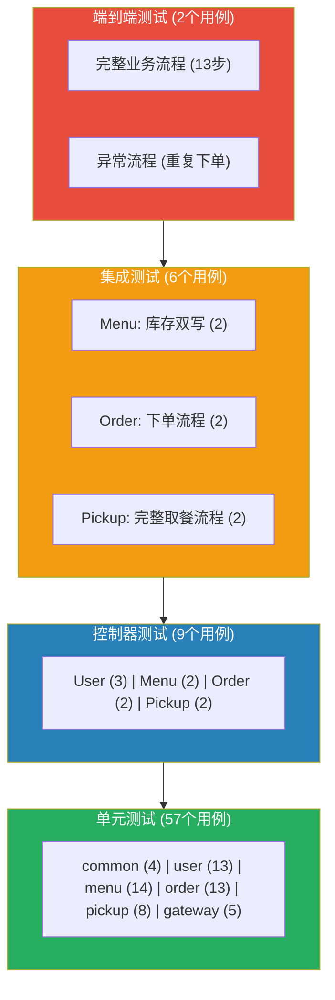
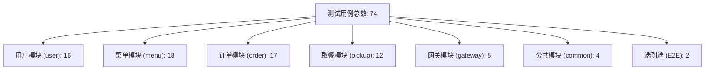

# 测试用例

| 项目 | 内容 |
| --- | --- |
| 项目名称 | 智能食堂点餐与取餐微服务系统 |
| 文档版本 | v2.0 |
| 编写日期 | 2026-05-21 |
| 修订日期 | 2026-06-15 |
| 编写人 | 高祥雨 |

---

## 1 测试概述

### 1.1 测试策略

| 测试层级 | 范围 | 工具 | 环境 |
| --- | --- | --- | --- |
| 单元测试 | Service 层核心逻辑 | JUnit 5 + Mockito | 无需外部依赖 |
| 控制器测试 | Controller 层接口 | @WebMvcTest + MockMvc | 无需外部依赖 |
| 集成测试 | 数据库 + Redis 交互 | @SpringBootTest + Testcontainers + H2 | 需要 Docker |
| 端到端测试 | 完整业务流程 | e2e.sh (curl) | 需要全部服务运行 |

### 1.2 测试环境配置

| 组件 | 版本 | 说明 |
| --- | --- | --- |
| JDK | 17 | 编译运行 |
| JUnit | 5.x | 测试框架 |
| Mockito | 5.x | Mock 框架 |
| Testcontainers | 1.19.6 | 容器化集成测试 |
| H2 | 2.x | 集成测试内存数据库 |

---

## 2 用户服务测试用例

### TC-U-01 用户注册 — 正常注册

| 项目 | 内容 |
| --- | --- |
| **测试类型** | 单元测试 |
| **前置条件** | 手机号 13800138001 未注册 |
| **输入** | phone=13800138001, studentNo=2024001, password=Test1234, nickname=张三 |
| **执行步骤** | 调用 AuthService.register(request) |
| **预期结果** | 返回 TokenResponse，accessToken 非空，userId > 0，数据库 user 表新增记录 |
| **验证点** | password_hash 为 BCrypt 加密值（非明文） |

### TC-U-02 用户注册 — 手机号重复

| 项目 | 内容 |
| --- | --- |
| **测试类型** | 单元测试 |
| **前置条件** | 手机号 13800138001 已注册 |
| **输入** | phone=13800138001, password=Test1234 |
| **执行步骤** | 调用 AuthService.register(request) |
| **预期结果** | 抛出 BusinessException，code=10006，message="手机号已注册" |

### TC-U-03 用户注册 — 学工号重复

| 项目 | 内容 |
| --- | --- |
| **测试类型** | 单元测试 |
| **前置条件** | 学工号 2024001 已被使用 |
| **输入** | phone=13800138002, studentNo=2024001, password=Test1234 |
| **执行步骤** | 调用 AuthService.register(request) |
| **预期结果** | 抛出 BusinessException，code=10001，message="学工号已注册" |

### TC-U-04 用户登录 — 密码登录成功

| 项目 | 内容 |
| --- | --- |
| **测试类型** | 单元测试 |
| **前置条件** | 用户已注册，phone=13800138001, password=Test1234 |
| **输入** | phone=13800138001, loginType=password, password=Test1234 |
| **执行步骤** | 调用 AuthService.login(request) |
| **预期结果** | 返回 TokenResponse，accessToken + refreshToken 均非空 |

### TC-U-05 用户登录 — 密码错误

| 项目 | 内容 |
| --- | --- |
| **测试类型** | 单元测试 |
| **前置条件** | 用户已注册 |
| **输入** | phone=13800138001, loginType=password, password=WrongPassword |
| **执行步骤** | 调用 AuthService.login(request) |
| **预期结果** | 抛出 BusinessException，code=10002，message="密码错误" |

### TC-U-06 用户登录 — 用户不存在

| 项目 | 内容 |
| --- | --- |
| **测试类型** | 单元测试 |
| **前置条件** | 无 |
| **输入** | phone=13999999999, loginType=password, password=xxx |
| **执行步骤** | 调用 AuthService.login(request) |
| **预期结果** | 抛出 BusinessException，code=10005 |

### TC-U-07 用户登录 — 验证码登录成功

| 项目 | 内容 |
| --- | --- |
| **测试类型** | 单元测试 |
| **前置条件** | 用户已注册 |
| **输入** | phone=13800138001, loginType=sms, verifyCode=123456 |
| **执行步骤** | 调用 AuthService.login(request) |
| **预期结果** | 返回 TokenResponse |

### TC-U-08 用户登录 — 验证码错误

| 项目 | 内容 |
| --- | --- |
| **测试类型** | 单元测试 |
| **前置条件** | 用户已注册 |
| **输入** | phone=13800138001, loginType=sms, verifyCode=000000 |
| **执行步骤** | 调用 AuthService.login(request) |
| **预期结果** | 抛出 BusinessException，code=10007 |

### TC-U-09 用户登录 — 账号被禁用

| 项目 | 内容 |
| --- | --- |
| **测试类型** | 单元测试 |
| **前置条件** | 用户 status=0（禁用） |
| **输入** | phone=13800138001, loginType=password, password=xxx |
| **执行步骤** | 调用 AuthService.login(request) |
| **预期结果** | 抛出 BusinessException，code=10008 |

### TC-U-10 Token 刷新 — 正常刷新

| 项目 | 内容 |
| --- | --- |
| **测试类型** | 单元测试 |
| **前置条件** | 持有有效的 refreshToken |
| **输入** | refreshToken={有效的refreshToken} |
| **执行步骤** | 调用 AuthService.refresh(request) |
| **预期结果** | 返回新的 accessToken + refreshToken，旧 refreshToken 记录被删除 |

### TC-U-11 Token 刷新 — 无效 Token

| 项目 | 内容 |
| --- | --- |
| **测试类型** | 单元测试 |
| **前置条件** | 无 |
| **输入** | refreshToken="invalid_token_string" |
| **执行步骤** | 调用 AuthService.refresh(request) |
| **预期结果** | 抛出 BusinessException，code=10003 |

### TC-U-12 Token 刷新 — Token 已吊销

| 项目 | 内容 |
| --- | --- |
| **测试类型** | 单元测试 |
| **前置条件** | refreshToken 的 jti 已从数据库删除（已使用过） |
| **输入** | refreshToken={已吊销的refreshToken} |
| **执行步骤** | 调用 AuthService.refresh(request) |
| **预期结果** | 抛出 BusinessException，code=10003 |

### TC-U-13 用户登出

| 项目 | 内容 |
| --- | --- |
| **测试类型** | 单元测试 |
| **前置条件** | 用户已登录，持有有效 accessToken |
| **输入** | userId=1, accessToken={有效的accessToken} |
| **执行步骤** | 调用 AuthService.logout(userId, accessToken) |
| **预期结果** | 无异常抛出；Redis 中存在 jwt:bl:{jti} 键；refresh_token 表该用户记录被清空 |

### TC-U-14 查询用户资料

| 项目 | 内容 |
| --- | --- |
| **测试类型** | 单元测试 |
| **前置条件** | userId=1 存在 |
| **输入** | userId=1 |
| **执行步骤** | 调用 UserProfileService.getProfile(userId) |
| **预期结果** | 返回 UserVO，包含 phone, nickname, studentNo 等字段 |

### TC-U-15 修改用户资料

| 项目 | 内容 |
| --- | --- |
| **测试类型** | 单元测试 |
| **前置条件** | userId=1 存在 |
| **输入** | userId=1, nickname="新昵称" |
| **执行步骤** | 调用 UserProfileService.updateProfile(userId, request) |
| **预期结果** | 数据库 user 表 nickname 更新为"新昵称" |

### TC-U-16 控制器 — 注册接口

| 项目 | 内容 |
| --- | --- |
| **测试类型** | 控制器测试 (@WebMvcTest) |
| **输入** | POST /api/user/auth/register, body: {phone, password, ...} |
| **预期结果** | HTTP 200, response body 含 accessToken |

### TC-U-17 控制器 — 登录接口

| 项目 | 内容 |
| --- | --- |
| **测试类型** | 控制器测试 (@WebMvcTest) |
| **输入** | POST /api/user/auth/login, body: {phone, loginType, password} |
| **预期结果** | HTTP 200, response body 含 accessToken |

### TC-U-18 控制器 — 查询资料（缺 Token）

| 项目 | 内容 |
| --- | --- |
| **测试类型** | 控制器测试 (@WebMvcTest) |
| **输入** | GET /api/user/users/me，无 Authorization header |
| **预期结果** | HTTP 401（网关层拦截） |

---

## 3 菜品菜单服务测试用例

### TC-M-01 新增菜品 — 正常创建

| 项目 | 内容 |
| --- | --- |
| **测试类型** | 单元测试 |
| **前置条件** | merchantId=1 存在 |
| **输入** | name="麻婆豆腐", merchantId=1, priceCents=1200, threshold=10 |
| **执行步骤** | 调用 DishService.create(request) |
| **预期结果** | 返回 DishVO，dish.id > 0，onShelf=1 |

### TC-M-02 新增菜品 — 价格边界值（1分）

| 项目 | 内容 |
| --- | --- |
| **测试类型** | 单元测试（边界测试） |
| **输入** | name="测试", merchantId=1, priceCents=1 |
| **预期结果** | 正常创建，priceCents=1 |

### TC-M-03 新增菜品 — 价格边界值（99999分）

| 项目 | 内容 |
| --- | --- |
| **测试类型** | 单元测试（边界测试） |
| **输入** | name="测试", merchantId=1, priceCents=99999 |
| **预期结果** | 正常创建，priceCents=99999 |

### TC-M-04 查询菜品列表 — 过滤下架

| 项目 | 内容 |
| --- | --- |
| **测试类型** | 单元测试 |
| **前置条件** | 数据库有 3 个菜品，其中 1 个 onShelf=0 |
| **执行步骤** | 调用 DishService.list(page=1, size=10) |
| **预期结果** | 返回 2 个菜品，下架菜品不在列表中 |

### TC-M-05 查询菜品列表 — 按商户筛选

| 项目 | 内容 |
| --- | --- |
| **测试类型** | 单元测试 |
| **前置条件** | merchantId=1 有菜品，merchantId=2 也有菜品 |
| **输入** | merchantId=1, page=1, size=10 |
| **预期结果** | 仅返回 merchantId=1 的菜品 |

### TC-M-06 修改菜品

| 项目 | 内容 |
| --- | --- |
| **测试类型** | 单元测试 |
| **前置条件** | dishId=1 存在 |
| **输入** | name="新名称", priceCents=1500 |
| **执行步骤** | 调用 DishService.update(dishId, request) |
| **预期结果** | 数据库 dish 表 name 和 priceCents 更新 |

### TC-M-07 删除菜品 — 软删除

| 项目 | 内容 |
| --- | --- |
| **测试类型** | 单元测试 |
| **前置条件** | dishId=1 存在 |
| **执行步骤** | 调用 DishService.delete(dishId) |
| **预期结果** | dish 表 deleted_at 非空，查询列表不再返回该菜品 |

### TC-M-08 上架菜品

| 项目 | 内容 |
| --- | --- |
| **测试类型** | 单元测试 |
| **前置条件** | dishId=1, onShelf=0 |
| **执行步骤** | 调用 DishService.toggleOnShelf(dishId) |
| **预期结果** | dish.onShelf 变为 1 |

### TC-M-09 下架菜品

| 项目 | 内容 |
| --- | --- |
| **测试类型** | 单元测试 |
| **前置条件** | dishId=1, onShelf=1 |
| **执行步骤** | 调用 DishService.toggleOnShelf(dishId) |
| **预期结果** | dish.onShelf 变为 0 |

### TC-M-10 库存扣减 — 正常扣减

| 项目 | 内容 |
| --- | --- |
| **测试类型** | 单元测试 |
| **前置条件** | Redis stock:1=50 |
| **输入** | items=[{dishId:1, quantity:3}] |
| **执行步骤** | 调用 StockService.deduct(items) |
| **预期结果** | 返回 true，Redis stock:1=47 |

### TC-M-11 库存扣减 — 库存不足

| 项目 | 内容 |
| --- | --- |
| **测试类型** | 单元测试 |
| **前置条件** | Redis stock:1=2 |
| **输入** | items=[{dishId:1, quantity:5}] |
| **执行步骤** | 调用 StockService.deduct(items) |
| **预期结果** | 返回 false，Redis stock:1 仍为 2（原子失败，不部分扣减） |

### TC-M-12 库存扣减 — 批量原子成功

| 项目 | 内容 |
| --- | --- |
| **测试类型** | 单元测试 |
| **前置条件** | Redis stock:1=10, stock:2=10 |
| **输入** | items=[{dishId:1, quantity:3}, {dishId:2, quantity:5}] |
| **预期结果** | 返回 true，stock:1=7, stock:2=5 |

### TC-M-13 库存扣减 — 批量部分不足

| 项目 | 内容 |
| --- | --- |
| **测试类型** | 单元测试 |
| **前置条件** | Redis stock:1=10, stock:2=2 |
| **输入** | items=[{dishId:1, quantity:3}, {dishId:2, quantity:5}] |
| **预期结果** | 返回 false，stock:1=10, stock:2=2（全部未扣减，原子失败） |

### TC-M-14 库存回滚

| 项目 | 内容 |
| --- | --- |
| **测试类型** | 单元测试 |
| **前置条件** | Redis stock:1=5 |
| **输入** | items=[{dishId:1, quantity:2}] |
| **执行步骤** | 调用 StockService.restore(items) |
| **预期结果** | Redis stock:1=7 |

### TC-M-15 低库存预警

| 项目 | 内容 |
| --- | --- |
| **测试类型** | 单元测试 |
| **前置条件** | Redis stock:1=6, dish.threshold=10 |
| **输入** | items=[{dishId:1, quantity:3}] |
| **执行步骤** | 调用 StockService.deduct(items) |
| **预期结果** | 返回 true；日志输出 WARN 级别 "Low stock alert" |

### TC-M-16 发布每日菜单 — 正常发布

| 项目 | 内容 |
| --- | --- |
| **测试类型** | 单元测试 |
| **前置条件** | merchantId=1 存在，dishId=1,2 存在 |
| **输入** | merchantId=1, bizDate="2026-05-21", sellStart="10:30", sellEnd="13:30", items=[{dishId:1,stockInit:50},{dishId:2,stockInit:30}] |
| **预期结果** | 创建 daily_menu + daily_menu_item，Redis stock:1=50, stock:2=30 |

### TC-M-17 发布每日菜单 — 重复发布

| 项目 | 内容 |
| --- | --- |
| **测试类型** | 单元测试 |
| **前置条件** | 同商户同日期已有菜单 |
| **输入** | 同上 |
| **预期结果** | 抛出 BusinessException，code=20004 |

### TC-M-18 库存扣减集成测试 — Redis + DB 双写

| 项目 | 内容 |
| --- | --- |
| **测试类型** | 集成测试 (Testcontainers Redis + H2) |
| **前置条件** | H2 中有测试数据 stock_left=20 |
| **输入** | items=[{dishId:1, quantity:5}] |
| **预期结果** | Redis stock:1=15，DB daily_menu_item.stock_left=15 |

### TC-M-19 批量库存扣减集成测试

| 项目 | 内容 |
| --- | --- |
| **测试类型** | 集成测试 |
| **前置条件** | H2 中 stock_left 分别为 20, 15 |
| **输入** | items=[{1,5}, {2,5}] |
| **预期结果** | Redis 和 DB 均更新：stock:1=15, stock:2=10 |

---

## 4 订单服务测试用例

### TC-O-01 下单 — 正常下单

| 项目 | 内容 |
| --- | --- |
| **测试类型** | 单元测试 |
| **前置条件** | 菜品 service Mock 返回正常；库存扣减 Mock 返回 true；商户 Mock 返回 counterId=C01 |
| **输入** | userId=1, merchantId=1, items=[{dishId:1,quantity:2}], idempotencyKey=key001 |
| **预期结果** | 返回 OrderVO，status=PLACED，totalCents > 0 |

### TC-O-02 下单 — 幂等性重复请求

| 项目 | 内容 |
| --- | --- |
| **测试类型** | 单元测试 |
| **前置条件** | 相同的 idempotencyKey 已在 60 秒内使用 |
| **输入** | idempotencyKey=key001（重复） |
| **预期结果** | 抛出 BusinessException，code=30005 |

### TC-O-03 下单 — 菜品已下架

| 项目 | 内容 |
| --- | --- |
| **测试类型** | 单元测试 |
| **前置条件** | 菜品 service Mock 返回 onShelf=0 |
| **输入** | items=[{dishId:1,quantity:1}] |
| **预期结果** | 抛出 BusinessException，code=20002 |

### TC-O-04 下单 — 库存不足

| 项目 | 内容 |
| --- | --- |
| **测试类型** | 单元测试 |
| **前置条件** | 库存扣减 Mock 返回 false |
| **输入** | items=[{dishId:1,quantity:99}] |
| **预期结果** | 抛出 BusinessException，code=20001 |

### TC-O-05 下单 — 商户不存在

| 项目 | 内容 |
| --- | --- |
| **测试类型** | 单元测试 |
| **前置条件** | 商户 service Mock 返回 null |
| **输入** | merchantId=999 |
| **预期结果** | 抛出 BusinessException，code=20005 |

### TC-O-06 状态机 — PLACED → ACCEPTED

| 项目 | 内容 |
| --- | --- |
| **测试类型** | 单元测试 |
| **输入** | currentStatus=PLACED, event="accept" |
| **预期结果** | 返回 ACCEPTED |

### TC-O-07 状态机 — ACCEPTED → PREPARING

| 项目 | 内容 |
| --- | --- |
| **测试类型** | 单元测试 |
| **输入** | currentStatus=ACCEPTED, event="start" |
| **预期结果** | 返回 PREPARING |

### TC-O-08 状态机 — PREPARING → WAITING_PICKUP

| 项目 | 内容 |
| --- | --- |
| **测试类型** | 单元测试 |
| **输入** | currentStatus=PREPARING, event="ready" |
| **预期结果** | 返回 WAITING_PICKUP |

### TC-O-09 状态机 — WAITING_PICKUP → PICKED_UP

| 项目 | 内容 |
| --- | --- |
| **测试类型** | 单元测试 |
| **输入** | currentStatus=WAITING_PICKUP, event="pickup" |
| **预期结果** | 返回 PICKED_UP |

### TC-O-10 状态机 — PLACED → CANCELED

| 项目 | 内容 |
| --- | --- |
| **测试类型** | 单元测试 |
| **输入** | currentStatus=PLACED, event="cancel" |
| **预期结果** | 返回 CANCELED |

### TC-O-11 状态机 — ACCEPTED → CANCELED

| 项目 | 内容 |
| --- | --- |
| **测试类型** | 单元测试 |
| **输入** | currentStatus=ACCEPTED, event="cancel" |
| **预期结果** | 返回 CANCELED |

### TC-O-12 状态机 — 非法转换（PREPARING 不可取消）

| 项目 | 内容 |
| --- | --- |
| **测试类型** | 单元测试 |
| **输入** | currentStatus=PREPARING, event="cancel" |
| **预期结果** | 抛出 BusinessException，code=30001 |

### TC-O-13 状态机 — 非法转换（PICKED_UP 不可再取餐）

| 项目 | 内容 |
| --- | --- |
| **测试类型** | 单元测试 |
| **输入** | currentStatus=PICKED_UP, event="pickup" |
| **预期结果** | 抛出 BusinessException，code=30001 |

### TC-O-14 RocketMQ 超时 — 正常超时取消

| 项目 | 内容 |
| --- | --- |
| **测试类型** | 单元测试 |
| **前置条件** | order 状态为 PLACED |
| **输入** | 消费消息 orderId=1 |
| **执行步骤** | OrderTimeoutListener 消费超时消息 |
| **预期结果** | order.status=CANCELED, cancelReason="超时自动取消"；库存回滚方法被调用 |

### TC-O-15 RocketMQ 超时 — 订单已完成不处理

| 项目 | 内容 |
| --- | --- |
| **测试类型** | 单元测试 |
| **前置条件** | order 状态为 PICKED_UP |
| **输入** | 消费消息 orderId=1 |
| **预期结果** | 订单状态不变，库存回滚方法未被调用 |

### TC-O-16 RocketMQ 超时 — 无效 orderId

| 项目 | 内容 |
| --- | --- |
| **测试类型** | 单元测试 |
| **输入** | 消费消息 "invalid_id" |
| **预期结果** | 日志输出 ERROR，不抛出异常（容错处理） |

### TC-O-17 控制器 — 下单接口

| 项目 | 内容 |
| --- | --- |
| **测试类型** | 控制器测试 (@WebMvcTest) |
| **输入** | POST /api/order/orders, body: {merchantId, items}, Header: Idempotency-Key |
| **预期结果** | HTTP 200，返回 orderId |

### TC-O-18 控制器 — 取消订单

| 项目 | 内容 |
| --- | --- |
| **测试类型** | 控制器测试 |
| **输入** | PUT /api/order/orders/1/cancel |
| **预期结果** | HTTP 200，status=CANCELED |

### TC-O-19 集成测试 — 完整下单流程

| 项目 | 内容 |
| --- | --- |
| **测试类型** | 集成测试 (H2 + Testcontainers Redis) |
| **步骤** | 1. 下单 → 2. 查订单详情 → 3. 接单 → 4. 制作 → 5. 完成入队 |
| **预期结果** | 每个步骤状态正常流转，最终 status=WAITING_PICKUP，pickupCode 非空 |

### TC-O-20 集成测试 — 下单库存检查

| 项目 | 内容 |
| --- | --- |
| **测试类型** | 集成测试 |
| **步骤** | 用库存不足的数据下单 |
| **预期结果** | 返回 20001 错误码，数据库无订单记录 |

---

## 5 取餐排队服务测试用例

### TC-P-01 入队 — 正常入队

| 项目 | 内容 |
| --- | --- |
| **测试类型** | 单元测试 |
| **前置条件** | counterId=C01 |
| **输入** | orderId=1, pickupCode=C01000001, userId=1, counterId=C01 |
| **预期结果** | Redis queue:C01 长度+1，code:C01:C01000001 指向 orderId=1 |

### TC-P-02 入队 — 多订单顺序

| 项目 | 内容 |
| --- | --- |
| **测试类型** | 单元测试 |
| **步骤** | 依次入队 orderId=1,2,3 |
| **预期结果** | queue:C01 中元素顺序为 [entry1, entry2, entry3]（FIFO） |

### TC-P-03 叫号 — 正常叫号

| 项目 | 内容 |
| --- | --- |
| **测试类型** | 单元测试 |
| **前置条件** | queue:C01 有 2 个元素 |
| **执行步骤** | 调用 call("C01") |
| **预期结果** | 返回队首 entry；queue:C01 长度-1；current:C01 指向该 entry；WebSocket 广播 CALL 事件 |

### TC-P-04 叫号 — 空队列

| 项目 | 内容 |
| --- | --- |
| **测试类型** | 单元测试 |
| **前置条件** | queue:C01 为空 |
| **执行步骤** | 调用 call("C01") |
| **预期结果** | 抛出 BusinessException，code=40003 |

### TC-P-05 核销 — 正常核销

| 项目 | 内容 |
| --- | --- |
| **测试类型** | 单元测试 |
| **前置条件** | code:C01:C01000001 → orderId=1 |
| **输入** | pickupCode=C01000001, counterId=C01 |
| **预期结果** | Feign 调用 markPickedUp(1)；索引被删除；WebSocket 广播 VERIFY 事件 |

### TC-P-06 核销 — 取餐码不存在

| 项目 | 内容 |
| --- | --- |
| **测试类型** | 单元测试 |
| **输入** | pickupCode=INVALID_CODE |
| **预期结果** | 抛出 BusinessException，code=40001 |

### TC-P-07 核销 — 自动定位窗口（不传 counterId）

| 项目 | 内容 |
| --- | --- |
| **测试类型** | 单元测试 |
| **前置条件** | pickup:counter:C01000001 → C01 |
| **输入** | pickupCode=C01000001（不传 counterId） |
| **预期结果** | 自动反查 counterId=C01，核销成功 |

### TC-P-08 大屏数据查询

| 项目 | 内容 |
| --- | --- |
| **测试类型** | 单元测试 |
| **前置条件** | current 有 1 条，queue 有 3 条，history 有 2 条 |
| **执行步骤** | 调用 getScreenData("C01") |
| **预期结果** | currentCalling 非空；waitingList 长度=3；historyList 长度=2 |

### TC-P-09 集成测试 — 入队→叫号→核销完整流程

| 项目 | 内容 |
| --- | --- |
| **测试类型** | 集成测试 (Testcontainers Redis) |
| **步骤** | 1. enqueue → 2. call → 3. verify |
| **预期结果** | 每步操作成功，核销后索引和数据正确清理 |

### TC-P-10 集成测试 — 多窗口独立队列

| 项目 | 内容 |
| --- | --- |
| **测试类型** | 集成测试 |
| **步骤** | C01 入队 2 单，C02 入队 1 单，分别叫号 |
| **预期结果** | 两个窗口队列互不影响 |

---

## 6 网关服务测试用例

### TC-G-01 JWT 校验 — 白名单放行

| 项目 | 内容 |
| --- | --- |
| **测试类型** | 单元测试 |
| **输入** | GET /api/user/auth/login，无 Token |
| **预期结果** | 直接放行，不返回 401 |

### TC-G-02 JWT 校验 — 缺少 Token

| 项目 | 内容 |
| --- | --- |
| **测试类型** | 单元测试 |
| **输入** | GET /api/user/users/me，无 Authorization header |
| **预期结果** | 返回 401 |

### TC-G-03 JWT 校验 — 无效 Token

| 项目 | 内容 |
| --- | --- |
| **测试类型** | 单元测试 |
| **输入** | Authorization: Bearer invalid_token |
| **预期结果** | 返回 401 |

### TC-G-04 限流 — IP 超限

| 项目 | 内容 |
| --- | --- |
| **测试类型** | 单元测试 |
| **前置条件** | Mock Redis INCR 返回 101 |
| **输入** | 任意请求 |
| **预期结果** | 返回 429 Too Many Requests |

### TC-G-05 限流 — 正常放行

| 项目 | 内容 |
| --- | --- |
| **测试类型** | 单元测试 |
| **前置条件** | Mock Redis INCR 返回 5 |
| **输入** | 任意请求 |
| **预期结果** | 正常放行 |

---

## 7 端到端测试用例

### E2E-01 完整业务流程

| 项目 | 内容 |
| --- | --- |
| **测试类型** | 端到端测试 |
| **前置条件** | 所有服务运行中，测试数据已初始化 |
| **执行方式** | `bash scripts/e2e.sh http://localhost:8080` |
| **步骤** | 1. 注册 2. 登录 3. 查资料 4. 查菜品 5. 发布菜单 6. 下单 7. 接单 8. 制作 9. 完成入队 10. 大屏查询 11. 叫号 12. 核销 13. 查订单 |
| **预期结果** | 全部 13 步成功执行 |

### E2E-02 异常流程 — 重复下单

| 项目 | 内容 |
| --- | --- |
| **测试类型** | 端到端测试 |
| **步骤** | 1. 用 idempotencyKey=dup-test 下单（成功） 2. 再次用相同 Key 下单 |
| **预期结果** | 第二次返回 30005（重复请求） |

---

## 8 测试用例统计

| 模块 | 单元测试 | 控制器测试 | 集成测试 | 合计 |
| --- | --- | --- | --- | --- |
| canteen-common | 4 | - | - | 4 |
| canteen-user | 13 | 3 | - | 16 |
| canteen-menu | 14 | 2 | 2 | 18 |
| canteen-order | 13 | 2 | 2 | 17 |
| canteen-pickup | 8 | 2 | 2 | 12 |
| canteen-gateway | 5 | - | - | 5 |
| E2E | 2 | - | - | 2 |
| **合计** | **59** | **9** | **6** | **74** |

---

## 9 修订历史

| 版本 | 日期 | 修订内容 |
| --- | --- | --- |
| v1.0 | 2026-05-21 | 初稿 |
| v2.0 | 2026-06-15 | 全面完善：扩充至 74 个测试用例，涵盖正常/异常/边界/集成/E2E |
