# 详细设计说明书

| 项目 | 内容 |
| --- | --- |
| 项目名称 | 智能食堂点餐与取餐微服务系统 |
| 文档版本 | v1.0 |
| 编写日期 | 2026-05-21 |

---

## 1 引言

本文档描述各微服务模块内部的详细实现，包括关键类、算法逻辑、数据结构、接口参数等，直接指导编码。

---

## 2 canteen-common 公共模块

### 2.1 Result 统一响应体

```java
public class Result<T> {
    private int code;      // 0=成功，其余为错误码
    private String message;
    private T data;
    private String traceId;
}
```

### 2.2 ResultCode 错误码枚举

| 枚举值 | code | message |
| --- | --- | --- |
| SUCCESS | 0 | 操作成功 |
| UNKNOWN_ERROR | 90000 | 系统内部错误 |
| USER_ALREADY_EXISTS | 10001 | 账号已存在 |
| USER_PASSWORD_ERROR | 10002 | 密码错误 |
| USER_TOKEN_INVALID | 10003 | Token 无效或已过期 |
| USER_TOKEN_EXPIRED | 10004 | Token 已过期 |
| USER_NOT_FOUND | 10005 | 用户不存在 |
| USER_PHONE_EXISTS | 10006 | 手机号已注册 |
| USER_VERIFY_CODE_ERROR | 10007 | 验证码错误 |
| USER_DISABLED | 10008 | 账号已被禁用 |
| MENU_STOCK_INSUFFICIENT | 20001 | 库存不足 |
| MENU_DISH_OFF_SHELF | 20002 | 菜品已下架 |
| MENU_DISH_NOT_FOUND | 20003 | 菜品不存在 |
| MENU_ALREADY_PUBLISHED | 20004 | 今日菜单已发布 |
| MENU_MERCHANT_NOT_FOUND | 20005 | 商户不存在 |
| ORDER_STATUS_ILLEGAL | 30001 | 订单状态非法 |
| ORDER_EXPIRED | 30002 | 订单已过期 |
| ORDER_NOT_FOUND | 30003 | 订单不存在 |
| ORDER_CANNOT_CANCEL | 30004 | 订单当前状态不可取消 |
| ORDER_IDEMPOTENT_DUPLICATE | 30005 | 重复请求 |
| PICKUP_CODE_NOT_FOUND | 40001 | 取餐码不存在 |
| PICKUP_ALREADY_VERIFIED | 40002 | 重复核销 |
| PICKUP_QUEUE_EMPTY | 40003 | 队列为空 |
| GATEWAY_RATE_LIMITED | 50001 | 请求过于频繁，请稍后再试 |
| GATEWAY_AUTH_FAILED | 50002 | 鉴权失败 |
| GATEWAY_SERVICE_UNAVAILABLE | 50003 | 服务暂不可用 |

### 2.3 JwtTokenProvider

- 算法：HS256
- AccessToken：`sub=userId, jti=uuid, role=user, exp=15min`
- RefreshToken：`sub=userId, jti=uuid, role=refresh, exp=7d`
- 黑名单：Redis `SET jwt:bl:{jti} 1 EX {剩余秒数}`

### 2.4 InternalTokenInterceptor

Feign 请求拦截器，自动注入 `X-Internal-Token` header，值从配置 `internal.token` 读取。

### 2.5 TraceIdFilter

Servlet Filter，生成/透传 `X-Trace-Id` 到 MDC。

---

## 3 user-service 用户服务

### 3.1 分层结构

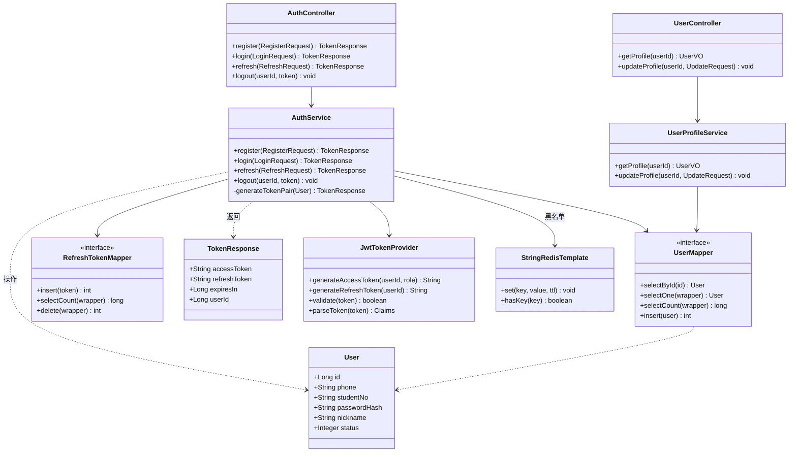

### 3.2 AuthService 算法逻辑

**注册**：
1. 校验手机号唯一性（`SELECT COUNT`）
2. 校验学工号唯一性
3. BCrypt（cost=10）加密密码
4. 插入 user 表
5. 调用 `generateTokenPair()` 返回双 Token

**登录**：
1. 按手机号查询用户
2. 判断用户状态（0=禁用）
3. 根据 `loginType` 校验密码或验证码
4. 调用 `generateTokenPair()` 返回双 Token

**刷新**：
1. 校验 refreshToken 有效性
2. 解析 claims，检查 role=refresh
3. 查 refresh_token 表确认 jti 未吊销
4. 删除旧 refresh_token 记录，颁发新双 Token

**登出**：
1. 解析 accessToken，获取 jti
2. Redis `SET jwt:bl:{jti} 1 EX {剩余TTL}`
3. 删除该用户所有 refresh_token 记录

### 3.3 认证流程序列图

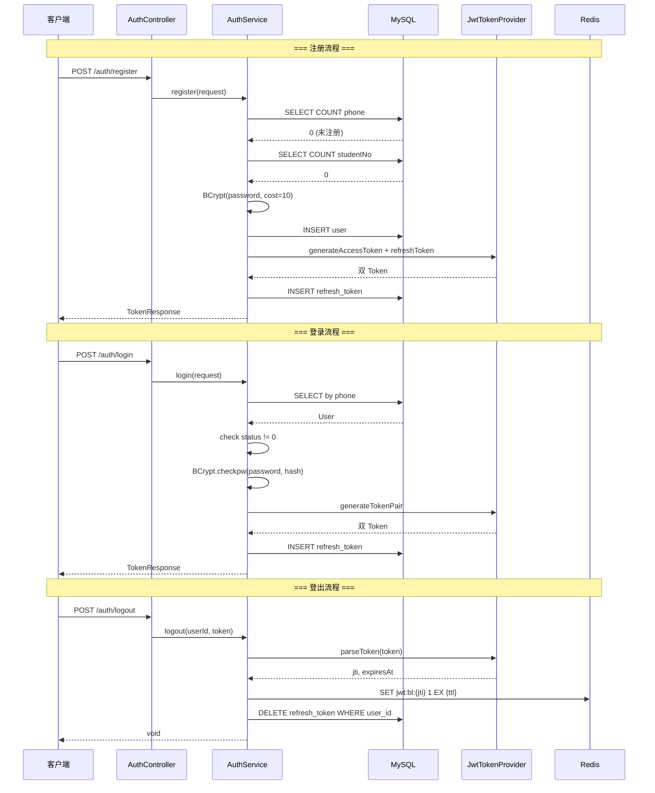

### 3.4 接口参数

**POST /auth/register**

```json
{
  "phone": "13800138000",       // 必填，11位手机号
  "studentNo": "2024001",       // 选填，学工号
  "password": "password123",    // 必填，6-20位
  "nickname": "昵称"            // 选填
}
```

**POST /auth/login**

```json
{
  "phone": "13800138000",       // 必填
  "loginType": "password",      // password | sms
  "password": "xxx",            // loginType=password时必填
  "verifyCode": "123456"        // loginType=sms时必填
}
```

**响应 TokenResponse**

```json
{
  "accessToken": "eyJhbGci...",
  "refreshToken": "eyJhbGci...",
  "expiresIn": 900,
  "userId": 1
}
```

---

## 4 menu-service 菜品菜单服务

### 4.1 分层结构

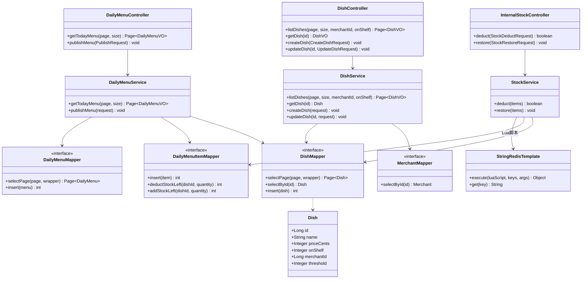

### 4.2 StockService 核心算法

**库存扣减（Redis Lua 原子脚本）**：

```lua
-- KEYS[i] = stock:{dishId}, ARGV[i] = quantity
for i = 1, #KEYS do
  local left = tonumber(redis.call('GET', KEYS[i]))
  if not left or left < tonumber(ARGV[i]) then return 0 end
end
for i = 1, #KEYS do
  redis.call('DECRBY', KEYS[i], ARGV[i])
end
return 1
```

- 返回 1 = 扣减成功，0 = 库存不足
- 先检查所有菜品库存是否充足，再批量扣减，保证原子性

**库存扣减 - 数据一致性策略**：

Redis 是请求时事实数据源，DB 作为持久化备份；二者通过 deduct/restore 双写保持一致。

1. Redis Lua 原子检查并扣减 `stock:{dishId}`
2. 成功后同步落库：`UPDATE daily_menu_item SET stock_left = stock_left - quantity WHERE dish_id = ? AND stock_left >= quantity`
3. 若 DB 更新行数为 0，记录 WARN 日志（不阻塞业务）

**库存回滚**：
1. Redis `INCRBY stock:{dishId} {quantity}`
2. MySQL `UPDATE daily_menu_item SET stock_left = stock_left + quantity`

**低库存预警**：
- 扣减后检查 `left < threshold`，记录 WARN 日志

### 4.3 库存扣减/回滚序列图

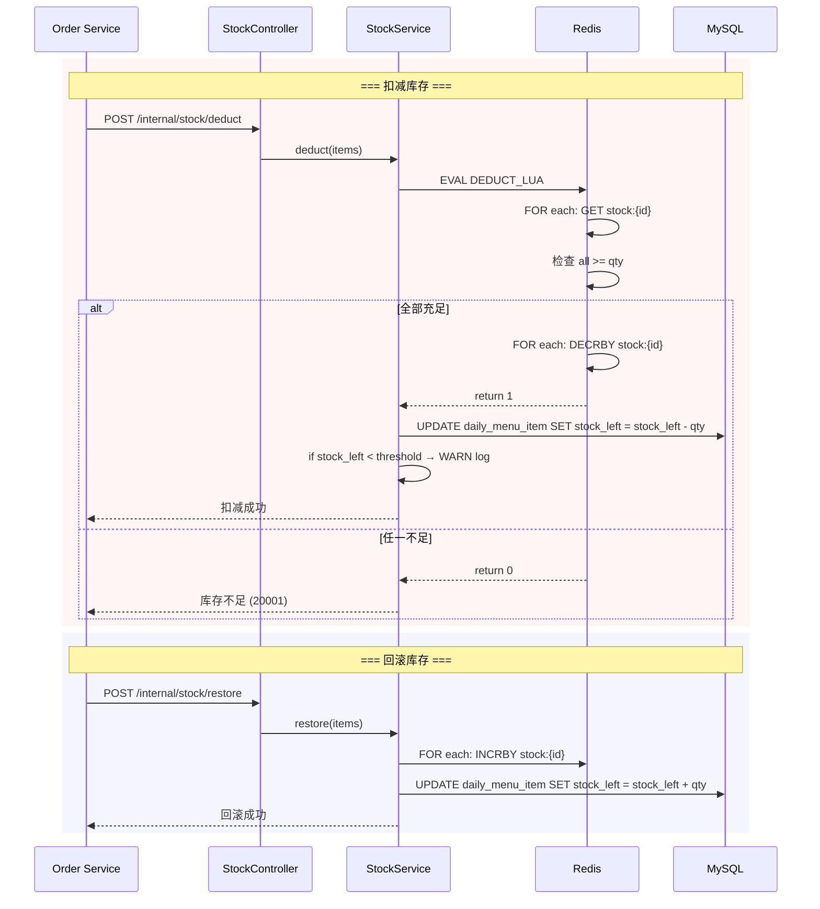

### 4.4 DailyMenuService 发布菜单

1. 校验同日同商户不能重复发布
2. 插入 `daily_menu` 记录
3. 逐条插入 `daily_menu_item`，初始化 Redis 库存 `SET stock:{dishId} {stockInit}`

---

## 5 order-service 订单服务

### 5.1 分层结构

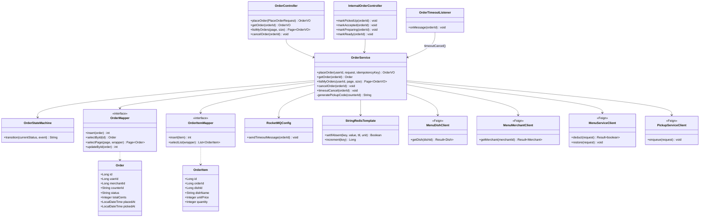

### 5.2 OrderStateMachine 状态机

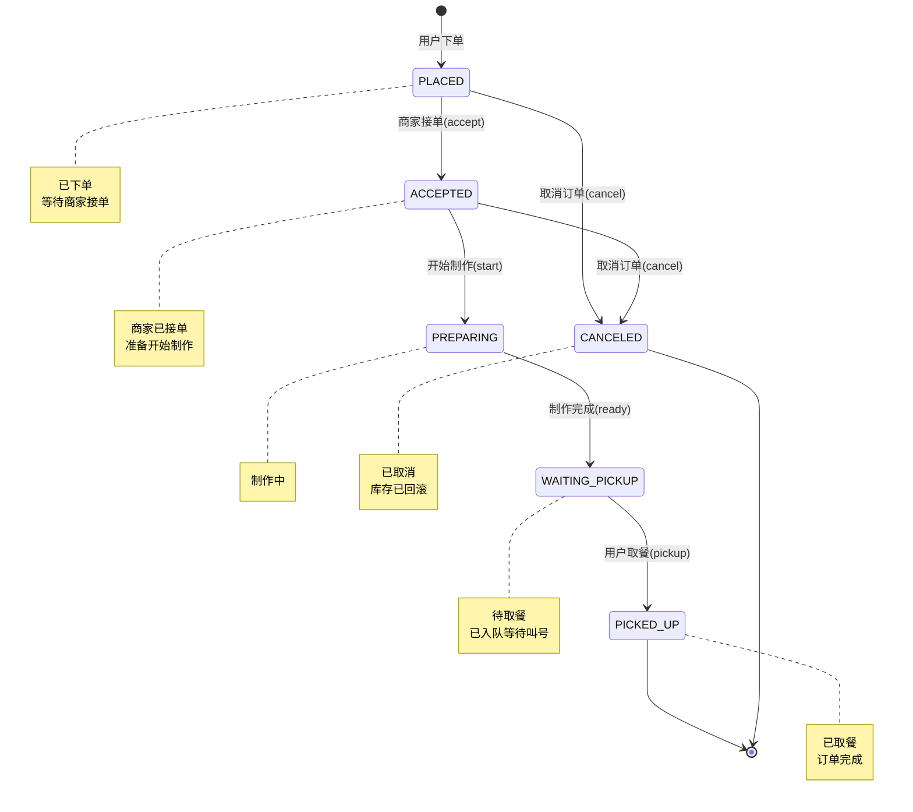

- `cancel` 仅允许从 `PLACED` 和 `ACCEPTED` 状态发起
- `PREPARING` 及之后不允许取消

### 5.3 OrderService.placeOrder 算法

1. **幂等校验**：Redis `SETNX order:idem:{key} 1 EX 60`
2. **计算总价**：遍历 items，Feign 获取菜品最新价格和上下架状态
3. **扣减库存**：Feign → menu-service `POST /internal/stock/deduct`
4. **查询窗口**：Feign → menu-service `GET /internal/merchants/{id}` 反查 counter_id
5. **落库**：本地事务插入 `orders` + `order_item`，状态 PLACED
6. **延时消息**：RocketMQ 发送 `order.timeout` 延时 30min（DELAY level = 16）
7. **失败回滚**：若第 3 步失败抛异常，不回滚（未落库）；若第 5 步失败，事务回滚由 Spring 管理；超时 / 用户取消触发 `restore`
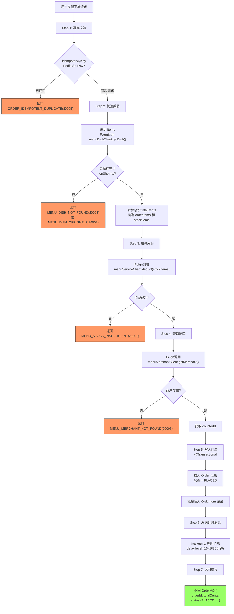

### 5.4 超时自动取消序列图

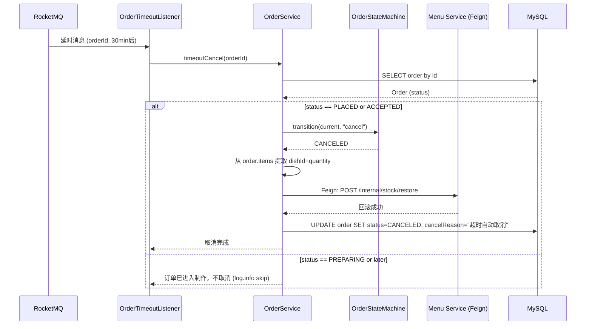

### 5.5 取餐码生成

```java
private String generatePickupCode(String counterId) {
    Long seq = redis.incr("pickup:code:seq:" + counterId);
    return String.format("%s%06d", counterId, seq % 1000000);
}
```

### 5.6 OrderTimeoutListener

消费 `order.timeout` 主题，若订单仍为 `PLACED`/`ACCEPTED`，则：
1. 状态置为 `CANCELED`
2. 回滚库存（Feign → menu-service `/internal/stock/restore`）

---

## 6 pickup-service 取餐排队服务

### 6.1 分层结构

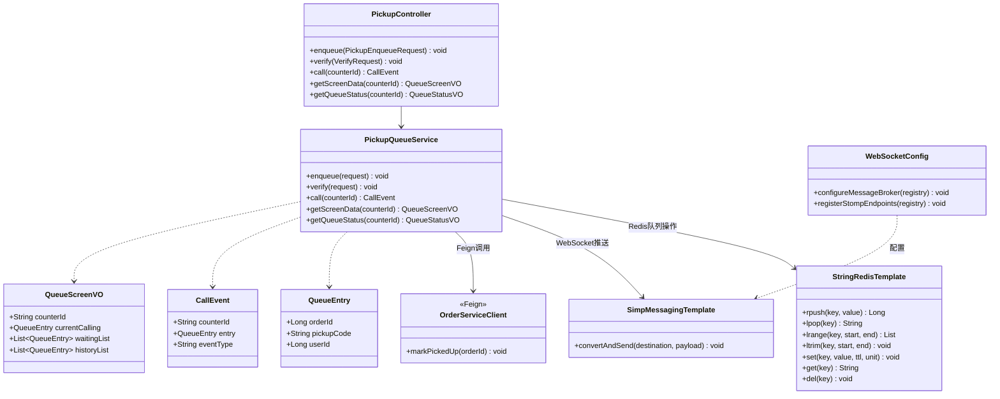

### 6.2 PickupQueueService 核心逻辑

**入队**：
1. `RPUSH queue:{counterId} {json: orderId, pickupCode, userId}`
2. 反向索引 `SET code:{counterId}:{pickupCode} {orderId} EX 86400`
3. 反向索引 `SET pickup:counter:{pickupCode} {counterId} EX 86400` （核销时按取餐码定位窗口）

**叫号**：
1. `LPOP queue:{counterId}` 取出队首
2. `SET queue:current:{counterId} {json} EX 86400`
3. `RPUSH queue:history:{counterId} {json}`（截断 ≤ 50）
4. WebSocket 广播 `CallEvent{counterId, entry, type="CALL"}` 到 `/topic/screen/{counterId}`

**核销**：
1. 若请求未传 counterId，通过 `GET pickup:counter:{pickupCode}` 反查
2. 通过反向索引 `code:{counterId}:{pickupCode}` 查找 orderId
3. Feign → order-service `POST /internal/orders/{id}/picked`
4. 删除两个反向索引（`code:*` 与 `pickup:counter:*`）和 current 记录
5. WebSocket 广播 `CallEvent{type="VERIFY"}`

**大屏数据**：
1. `GET queue:current:{counterId}` → 当前叫号
2. `LRANGE queue:{counterId} 0 -1` → 等待队列
3. `LRANGE queue:history:{counterId} -10 -1` → 最近 10 条历史

### 6.3 排队叫号序列图

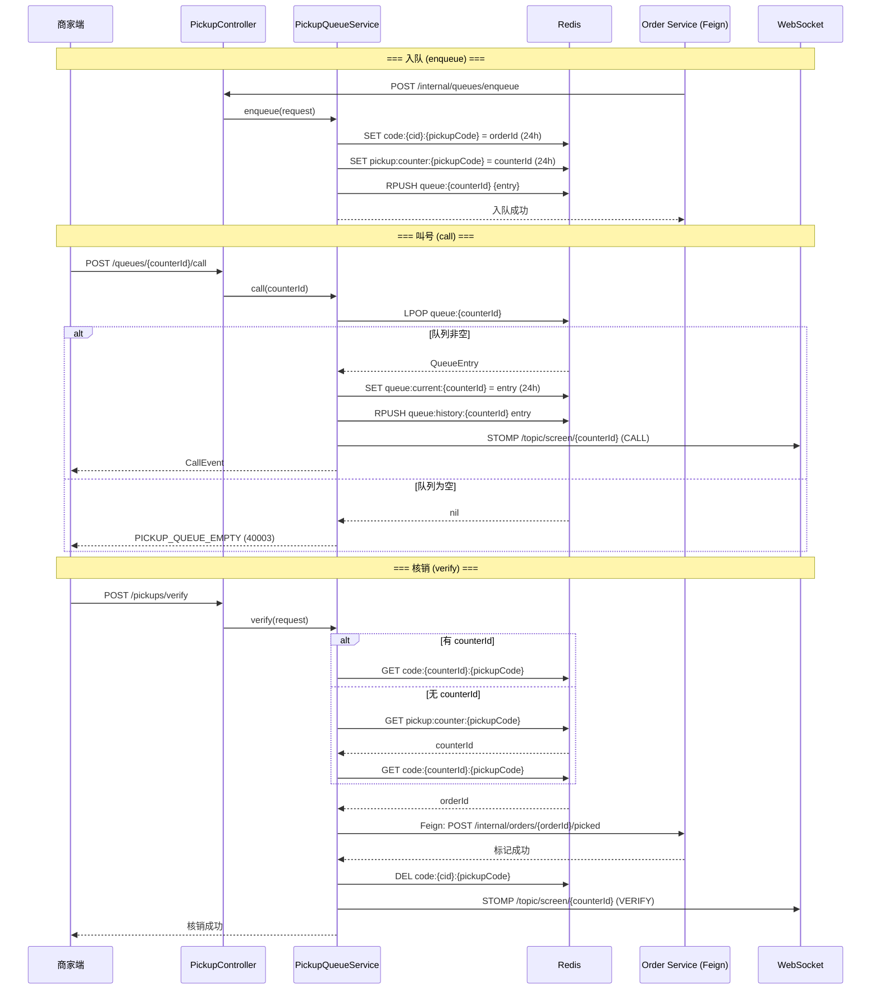

### 6.4 WebSocket 配置

- STOMP 协议，端点 `/ws/screen`
- 客户端订阅 `/topic/screen/{counterId}`
- 服务端通过 `SimpMessagingTemplate.convertAndSend()` 推送

---

## 7 gateway-service 网关服务

### 7.1 全局过滤器链

| 顺序 | 过滤器 | 职责 |
| --- | --- | --- |
| -100 | TraceIdGlobalFilter | 生成/透传 X-Trace-Id |
| -60 | RateLimitFilter | IP 级 + 用户级限流（Redis 计数器） |
| -50 | JwtAuthGlobalFilter | JWT 校验 + 黑名单检查 + 下游 header 注入 |
| -1 | GlobalErrorFilter | 统一异常响应 |
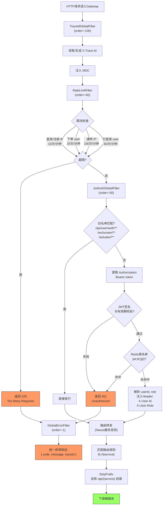

### 7.2 路由配置

| 路由 ID | URI | 路径匹配 | StripPrefix |
| --- | --- | --- | --- |
| user | lb://user-service | /api/user/** | 2 |
| menu | lb://menu-service | /api/menu/** | 2 |
| order | lb://order-service | /api/order/** | 2 |
| pickup | lb://pickup-service | /api/pickup/** | 2 |
| pickup-ws | lb:ws://pickup-service | /ws/screen/** | 0 |

### 7.3 限流规则

| 维度 | 限流对象 | 阈值 | 窗口 |
| --- | --- | --- | --- |
| 服务级（Sentinel） | user-service | 100 QPS | 1s |
| 服务级（Sentinel） | order-service | 50 QPS | 1s |
| IP 级（Redis） | 登录/注册接口 | 10 次/IP | 60s |
| IP 级（Redis） | 所有接口 | 100 次/IP | 60s |
| 用户级（Redis） | 下单接口 | 20 次/用户 | 60s |
| 用户级（Redis） | 所有接口 | 60 次/用户 | 60s |
