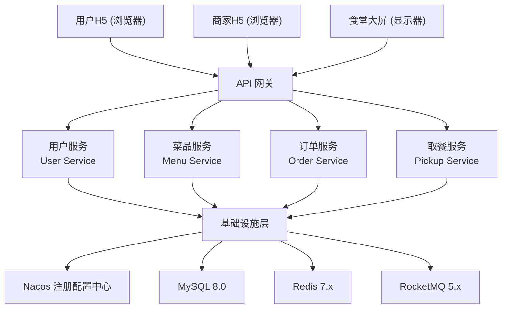
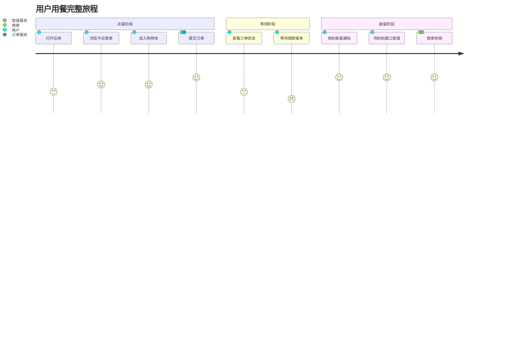
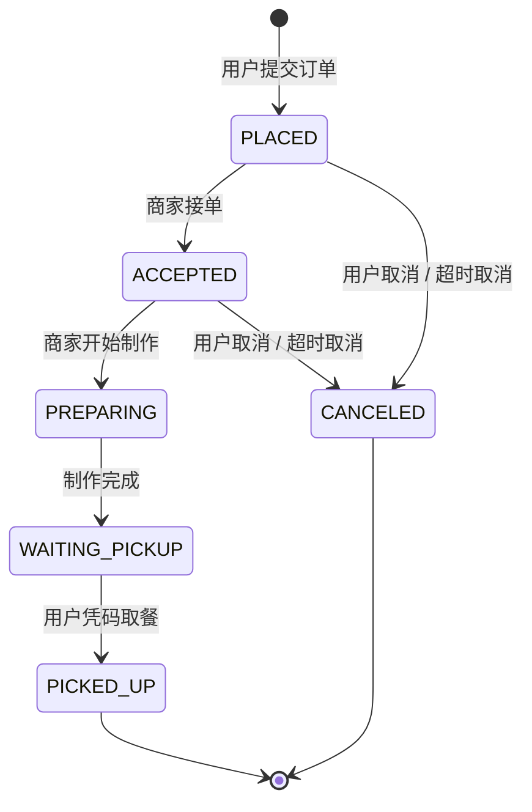
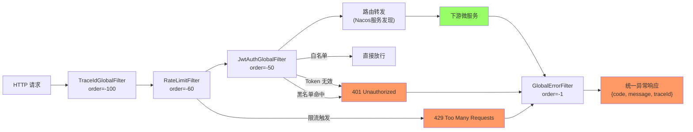
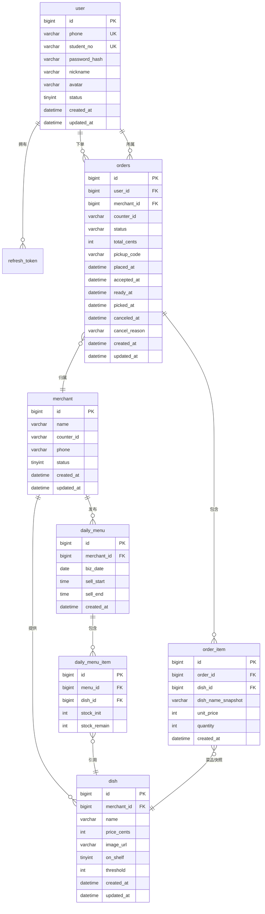
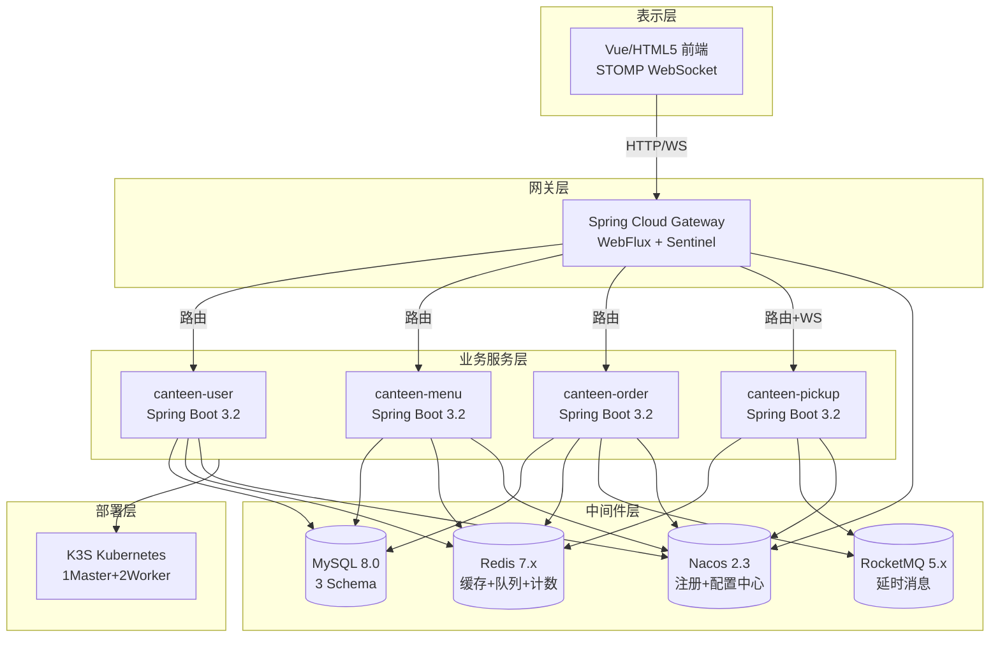
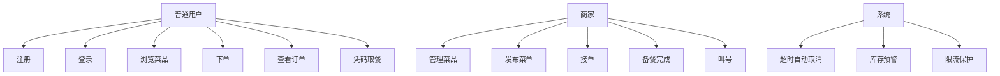

# 需求规格说明书

| 项目 | 内容 |
| --- | --- |
| 项目名称 | 智能食堂点餐与取餐微服务系统 |
| 文档版本 | v2.0 |
| 编写日期 | 2026-05-21 |
| 修订日期 | 2026-06-15 |
| 编写人 | 高祥雨

---

## 1 引言

### 1.1 项目背景

随着高校和科技园区规模的不断扩大，传统食堂在用餐高峰期面临排队时间长、菜品信息不透明、取餐效率低下等问题。传统的"先排队、再点餐、后取餐"模式导致食堂运营效率低下，用户体验差。本项目旨在开发一套基于微服务架构的智能食堂点餐与取餐系统，通过数字化手段重构食堂运营流程，实现"在线点餐 → 商家接单备餐 → 凭码取餐 → 大屏实时展示"的完整闭环。

### 1.2 项目目标

| 目标 | 描述 | 衡量指标 |
| --- | --- | --- |
| 功能完整性 | 覆盖用户、菜品、订单、取餐、网关 5 个微服务 | 端到端业务流程跑通 |
| 技术实践 | 合理使用 Spring Cloud Alibaba 全套组件 | Nacos/Gateway/Sentinel/Feign/RocketMQ 均使用 |
| 可部署性 | 支持 Docker Compose 本地开发和 K3S 生产部署 | 一键部署脚本 |
| 文档完备 | 编写完整的软件工程文档 | 需求/概要/详细/测试/部署 5 类文档 |
| 质量保障 | 单元测试 + 集成测试覆盖核心逻辑 | 测试用例 ≥ 50 个，覆盖率 ≥ 70% |

### 1.3 术语与缩略语

| 术语 | 说明 |
| --- | --- |
| JWT | JSON Web Token，用于无状态身份认证 |
| SCA | Spring Cloud Alibaba，阿里巴巴微服务解决方案 |
| Nacos | 动态服务发现、配置管理平台 |
| Sentinel | 流量控制、熔断降级组件 |
| RocketMQ | 分布式消息中间件，支持延时消息 |
| Feign | 声明式 HTTP 客户端，用于微服务间调用 |
| K3S | 轻量级 Kubernetes 发行版，适用于边缘/IoT 场景 |
| STOMP | Simple Text Oriented Messaging Protocol，WebSocket 子协议 |
| FIFO | First In First Out，先进先出队列 |
| BCrypt | 基于 Blowfish 的密码哈希算法 |

### 1.4 参考文献

- Spring Cloud Alibaba 官方文档 (https://sca.aliyun.com)
- Spring Cloud Gateway 官方文档
- Nacos 官方文档 (https://nacos.io)
- RocketMQ 官方文档 (https://rocketmq.apache.org)
- K3S 官方文档 (https://docs.k3s.io)
- IEEE 830-1998 软件需求规格说明书标准

---

## 2 总体描述

### 2.1 产品视角

本系统是一个独立的微服务集群，通过统一的 API 网关对外提供服务。系统与外部系统的关系如下：


### 2.2 用户特征

| 用户角色 | 特征描述 | 主要操作 |
| --- | --- | --- |
| **学生/教职工（普通用户）** | 日常用餐需求，使用手机操作 | 注册、登录、浏览菜品、下单、查看订单、扫码取餐 |
| **食堂商家/窗口工作人员** | 管理菜品和接单，使用商家端 | 发布菜品、管理菜单、接单、备餐、叫号 |
| **食堂管理员** | 监控食堂运营状态 | 查看大屏、管理商户、查看统计数据 |
| **系统管理员** | 维护系统运行 | 配置管理、监控告警、日志查看 |



### 2.3 运行环境

| 环境 | 说明 | 配置 |
| --- | --- | --- |
| 开发环境 | 本地开发调试 | Docker Compose 启动基础设施 + IDE 运行服务 |
| 测试环境 | 集成测试 | Testcontainers（Redis）+ H2 内存数据库 |
| 生产环境 | K3S 集群部署 | 1 Master + 2 Worker 节点 |

### 2.4 假设与约束

| 类别 | 内容 |
| --- | --- |
| 假设 | 用户拥有智能手机并能访问网络；食堂窗口均配有显示屏；网络环境稳定 |
| 技术约束 | 使用 Java 17 + Spring Boot 3.2.x；数据库使用 MySQL 8.0；部署于 K3S 集群 |
| 业务约束 | 每日菜单需提前发布；下单后 30 分钟内未接单自动取消；取餐码当日有效 |
| 安全约束 | 密码须 BCrypt 加密存储；外部接口须 JWT 鉴权；内部接口通过 X-Internal-Token 校验 |

---

## 3 功能需求

### 3.1 用户服务（User Service）

#### 3.1.1 功能概述

用户服务是整个系统的身份认证中心，负责用户注册、登录、Token 管理和用户资料维护。

#### 3.1.2 详细功能需求

| 编号 | 功能名称 | 详细描述 | 优先级 | 输入 | 输出 |
| --- | --- | --- | --- | --- | --- |
| FR-U-01 | 手机号注册 | 用户通过手机号和密码注册账号，支持填写学工号和昵称 | 必选 | phone, password, studentNo(选填), nickname(选填) | accessToken, refreshToken, userId |
| FR-U-02 | 学工号唯一性检查 | 注册时检查学工号是否已被使用 | 必选 | studentNo | 通过/失败 |
| FR-U-03 | 密码登录 | 用户通过手机号+密码登录 | 必选 | phone, loginType=password, password | accessToken, refreshToken |
| FR-U-04 | 验证码登录 | 用户通过手机号+短信验证码登录（开发环境验证码固定为 123456） | 必选 | phone, loginType=sms, verifyCode | accessToken, refreshToken |
| FR-U-05 | Token 颁发 | 登录成功后颁发双 Token：accessToken（15分钟有效）+ refreshToken（7天有效） | 必选 | userId, role | accessToken(15min), refreshToken(7d) |
| FR-U-06 | Token 刷新 | 使用有效的 refreshToken 换取新的双 Token，旧 refreshToken 失效 | 必选 | refreshToken | 新的 accessToken + refreshToken |
| FR-U-07 | 登出 | 将当前 accessToken 加入 Redis 黑名单，删除所有 refreshToken 记录 | 必选 | accessToken | 成功/失败 |
| FR-U-08 | 查询个人资料 | 已登录用户查询自己的个人信息 | 必选 | userId（从 Token 解析） | 用户信息 JSON |
| FR-U-09 | 修改个人资料 | 已登录用户修改昵称、头像等信息 | 必选 | nickname, avatar | 更新后的用户信息 |
| FR-U-10 | 账号禁用检查 | 登录时检查账号状态，禁用账号（status=0）拒绝登录 | 必选 | userId | 通过/拒绝 |
| FR-U-11 | 密码加密存储 | 所有密码使用 BCrypt(cost=10) 加盐哈希后存储 | 必选 | password | password_hash |

#### 3.1.3 业务规则

1. **密码规则**：长度 6-20 位，支持字母、数字、特殊字符
2. **手机号规则**：11 位中国大陆手机号格式
3. **Token 有效期**：accessToken 15 分钟，refreshToken 7 天
4. **黑名单机制**：登出时 accessToken 加入 Redis 黑名单，TTL 为 Token 剩余有效时间
5. **refreshToken 轮转**：每次刷新颁发新 refreshToken，旧记录从数据库删除（防重放攻击）

---

### 3.2 菜品与菜单服务（Menu Service）

#### 3.2.1 功能概述

菜品与菜单服务管理食堂的菜品信息、每日菜单发布、库存管理和菜品上下架控制。

#### 3.2.2 详细功能需求

| 编号 | 功能名称 | 详细描述 | 优先级 | 输入 | 输出 |
| --- | --- | --- | --- | --- | --- |
| FR-M-01 | 新增菜品 | 商家新增菜品，包含名称、价格（分）、图片、预警阈值 | 必选 | merchantId, name, priceCents, imageUrl, threshold | 菜品信息 |
| FR-M-02 | 修改菜品 | 修改菜品名称、价格、图片、阈值等信息 | 必选 | dishId, 修改字段 | 更新后的菜品信息 |
| FR-M-03 | 删除菜品 | 逻辑删除菜品（软删除） | 必选 | dishId | 成功/失败 |
| FR-M-04 | 查询菜品列表 | 分页查询菜品，可按商户ID筛选，支持上下架状态过滤 | 必选 | page, size, merchantId(选填) | 分页菜品列表 |
| FR-M-05 | 上下架切换 | 切换菜品的上下架状态，下架菜品用户端不可见 | 必选 | dishId | 更新后的状态 |
| FR-M-06 | 发布每日菜单 | 为指定商户发布当日菜单，设定售卖时段和每道菜品的初始库存 | 必选 | merchantId, bizDate, sellStart, sellEnd, items[{dishId,stockInit}] | 菜单信息 |
| FR-M-07 | 查询每日菜单 | 查询指定日期的菜单，含库存余量 | 必选 | bizDate(选填，默认今天) | 菜单详情 |
| FR-M-08 | 库存扣减 | 批量原子扣减库存（Redis Lua 脚本），同时同步更新数据库 | 必选 | items[{dishId, quantity}] | 成功/库存不足 |
| FR-M-09 | 库存回滚 | 订单取消时回滚库存（Redis + DB 双写） | 必选 | items[{dishId, quantity}] | 成功/失败 |
| FR-M-10 | 低库存预警 | 库存低于菜品设置的 threshold 值时输出 WARN 级别日志 | 必选 | 自动触发 | WARN 日志 |
| FR-M-11 | 商户信息查询 | 按商户ID查询商户信息（含取餐窗口 counterId） | 必选 | merchantId | 商户信息 |
| FR-M-12 | 菜品信息查询（内部） | 供订单服务通过 Feign 查询单个菜品详情（用于下单时校验） | 必选 | dishId | 菜品详情（含上下架状态） |

#### 3.2.3 业务规则

1. **库存扣减原则**：必须使用 Redis Lua 脚本保证原子性，所有 Key 在同一 Lua 脚本中操作
2. **双写一致性**：Redis 扣减成功后立即同步更新数据库（daily_menu_item.stock_left -= quantity）
3. **预警机制**：扣减后 Redis 库存 < dish.threshold 时触发 WARN 日志
4. **上下架控制**：用户端查询菜品时自动过滤 on_shelf=0 的记录
5. **售卖时段**：每日菜单仅在 sellStart ~ sellEnd 时段内有效
6. **幂等性**：同一天同一商户不可重复发布菜单

---

### 3.3 订单服务（Order Service）

#### 3.3.1 功能概述

订单服务管理用户下单、订单状态流转、超时取消和取餐码生成的完整生命周期。

#### 3.3.2 详细功能需求

| 编号 | 功能名称 | 详细描述 | 优先级 | 输入 | 输出 |
| --- | --- | --- | --- | --- | --- |
| FR-O-01 | 用户下单 | 用户选择菜品下单，系统校验菜品、扣减库存、创建订单、发送延时消息 | 必选 | merchantId, items[{dishId,quantity}], idempotencyKey | orderId, totalCents, status |
| FR-O-02 | 幂等性校验 | 通过 Idempotency-Key 防止重复提交，60秒内相同 Key 返回重复请求错误 | 必选 | idempotencyKey | 通过/重复 |
| FR-O-03 | 订单状态流转 | 支持完整状态机：PLACED → ACCEPTED → PREPARING → WAITING_PICKUP → PICKED_UP | 必选 | orderId, 操作类型 | 新状态 |
| FR-O-04 | 商家接单 | 商家确认接收订单，状态变更为 ACCEPTED | 必选 | orderId | 更新后的订单 |
| FR-O-05 | 开始制作 | 商家开始备餐，状态变更为 PREPARING | 必选 | orderId | 更新后的订单 |
| FR-O-06 | 制作完成 | 菜品制作完毕，生成取餐码并入队，状态变更为 WAITING_PICKUP | 必选 | orderId | 更新后的订单（含 pickupCode） |
| FR-O-07 | 用户取消订单 | 用户在 PLACED 或 ACCEPTED 状态下主动取消，回滚库存 | 必选 | orderId, cancelReason | 更新后的订单 |
| FR-O-08 | 超时自动取消 | RocketMQ 延时消息 30 分钟后触发，若订单仍为 PLACED/ACCEPTED 则自动取消并回滚库存 | 必选 | 自动触发 | 更新后的订单 |
| FR-O-09 | 查询订单详情 | 查询单个订单的完整信息，包含订单明细 | 必选 | orderId | 订单详情 JSON |
| FR-O-10 | 查询订单列表 | 分页查询用户的所有订单，按时间倒序 | 必选 | userId, page, size | 分页订单列表 |
| FR-O-11 | 取餐码生成 | 制作完成时生成取餐码（格式：{counterId}{6位序列号}），通过 Feign 通知取餐服务入队 | 必选 | counterId | pickupCode |
| FR-O-12 | 标记已取餐 | 供取餐服务通过 Feign 调用，核销后状态变更为 PICKED_UP | 必选 | orderId | 更新后的订单 |

#### 3.3.3 订单状态机定义

| 当前状态 | 允许的操作 | 目标状态 | 触发条件 |
| --- | --- | --- | --- |
| - | place | PLACED | 用户提交订单 |
| PLACED | accept | ACCEPTED | 商家确认接单 |
| PLACED | cancel | CANCELED | 用户主动取消 / 超时自动取消 |
| ACCEPTED | start | PREPARING | 商家开始制作 |
| ACCEPTED | cancel | CANCELED | 用户主动取消 / 商家超时未备餐 |
| PREPARING | ready | WAITING_PICKUP | 商家标记制作完成 |
| WAITING_PICKUP | pickup | PICKED_UP | 用户凭码核销取餐 |



#### 3.3.4 业务规则

1. **下单流程**：幂等校验 → 查询菜品（含上下架过滤）→ 批量扣减库存 → 写订单+明细（事务） → 发送 30min 延时消息
2. **库存预占**：下单时立即扣减，取消时回滚
3. **幂等窗口**：60 秒，基于 Redis SETNX 实现
4. **超时时间**：30 分钟，使用 RocketMQ 延时消息（delay level=16）
5. **取餐码格式**：`C01` + 6 位数字序列（如 `C01000012`），全局递增

---

### 3.4 取餐与排队服务（Pickup Service）

#### 3.4.1 功能概述

取餐与排队服务为每个食堂窗口维护 FIFO 取餐队列，支持叫号、核销和大屏实时显示。

#### 3.4.2 详细功能需求

| 编号 | 功能名称 | 详细描述 | 优先级 | 输入 | 输出 |
| --- | --- | --- | --- | --- | --- |
| FR-P-01 | 入队 | 订单制作完成后入队，记录取餐码和订单信息到 Redis List | 必选 | orderId, pickupCode, userId, counterId | 成功/失败 |
| FR-P-02 | 叫号 | 从队首取出一个订单标记为"当前叫号"，通过 WebSocket 广播 | 必选 | counterId | 被叫号的订单信息 |
| FR-P-03 | 核销 | 用户凭取餐码核销，验证有效性后标记订单已取餐 | 必选 | pickupCode, counterId(选填) | 成功/取餐码无效 |
| FR-P-04 | 大屏数据查询 | 返回当前叫号 + 等待队列 + 最近历史记录 | 必选 | counterId | QueueScreenVO |
| FR-P-05 | WebSocket 推送 | 叫号和核销事件实时推送到订阅了大屏频道的客户端 | 必选 | 事件触发 | STOMP 消息 |
| FR-P-06 | 反向索引 | 维护 pickupCode → counterId 的反向索引，核销时无需指定窗口 | 必选 | 自动维护 | - |
| FR-P-07 | 历史记录 | 保留最近 50 条叫号历史 | 必选 | 自动维护 | - |

#### 3.4.3 数据结构（Redis）

| Key 模式 | 类型 | 说明 | TTL |
| --- | --- | --- | --- |
| `queue:{counterId}` | List | 待取队列（FIFO），元素为 JSON `{orderId, pickupCode, userId}` | 永久 |
| `queue:current:{counterId}` | String | 当前叫号订单 JSON | 24h |
| `queue:history:{counterId}` | List | 已叫号历史（最多 50 条） | 永久 |
| `code:{counterId}:{pickupCode}` | String | pickupCode → orderId 反向索引 | 24h |
| `pickup:counter:{pickupCode}` | String | pickupCode → counterId 反向索引 | 24h |

#### 3.4.4 业务规则

1. **FIFO 保证**：使用 Redis List RPUSH（入队）+ LPOP（出队）保证先进先出
2. **空队处理**：队列为空时叫号返回 PICKUP_QUEUE_EMPTY 错误
3. **核销去重**：核销后删除反向索引，重复核销返回 PICKUP_CODE_NOT_FOUND
4. **窗口定位**：核销时若未传 counterId，通过 pickup:counter:{pickupCode} 反查
5. **WebSocket 频道**：`/topic/screen/{counterId}`，每个窗口独立频道

---

### 3.5 网关服务（Gateway Service）

#### 3.5.1 功能概述

网关服务作为系统统一入口，负责路由转发、JWT 鉴权、限流控制和 WebSocket 代理。

#### 3.5.2 详细功能需求

| 编号 | 功能名称 | 详细描述 | 优先级 | 输入 | 输出 |
| --- | --- | --- | --- | --- | --- |
| FR-G-01 | 路由转发 | 从 Nacos 获取服务列表，按 `/api/{service}/**` 规则路由到对应微服务 | 必选 | HTTP 请求 | 转发到目标服务 |
| FR-G-02 | 白名单放行 | 登录、注册、大屏查询、WebSocket 握手等路径无需 JWT 校验 | 必选 | 请求路径 | 放行/校验 |
| FR-G-03 | JWT 校验 | 校验 Token 有效性，检查是否在黑名单中，解析用户信息注入下游 Header | 必选 | Authorization Header | X-User-Id, X-User-Role |
| FR-G-04 | IP 级限流 | 基于 Redis 计数器实现 IP 级别限流（100次/分钟） | 必选 | 客户端 IP | 放行/429 |
| FR-G-05 | 用户级限流 | 已登录用户按 userId 限流（60次/分钟） | 必选 | userId | 放行/429 |
| FR-G-06 | 登录接口限流 | 登录/注册接口 IP 级别严限流（10次/分钟），防暴力破解 | 必选 | 客户端 IP | 放行/429 |
| FR-G-07 | 下单接口限流 | 下单接口用户级限流（20次/分钟），防刷单 | 必选 | userId | 放行/429 |
| FR-G-08 | Sentinel 服务级限流 | 基于 Sentinel 的按路由 ID 限流，作为全局保护伞 | 必选 | 路由 ID | 放行/限流 |
| FR-G-09 | WebSocket 代理 | 代理 WebSocket 请求到 pickup-service（lb:ws://） | 必选 | WS 握手 | 代理连接 |
| FR-G-10 | 统一异常处理 | 网关层异常统一返回 `{code, message, traceId}` 格式 | 必选 | 异常 | 统一错误响应 |
| FR-G-11 | TraceId 透传 | 生成/透传 X-Trace-Id 实现全链路追踪 | 必选 | 请求头 | 注入 TraceId |

#### 3.5.3 全局过滤器链

| 顺序 | 过滤器 | 职责 |
| --- | --- | --- |
| -100 | TraceIdGlobalFilter | 生成/透传 X-Trace-Id 到 MDC |
| -60 | RateLimitFilter | 四级限流：登录IP、下单用户、通用IP、已登录用户 |
| -50 | JwtAuthGlobalFilter | JWT 校验 + 黑名单 + 用户信息注入 |
| -1 | GlobalErrorFilter | 统一异常响应格式 |



---

## 4 非功能需求

### 4.1 性能需求

| 指标 | 目标值 | 测试方法 |
| --- | --- | --- |
| 单服务 QPS | ≥ 200 | JMeter 压测 |
| 下单接口 P95 延迟 | ≤ 500ms | 通过 TraceId 统计 |
| 库存扣减延迟 | ≤ 50ms | Redis Lua 原子操作 |
| 数据库连接池 | HikariCP, max=20 | 配置 |
| Redis 连接池 | Lettuce, max=8 | 配置 |

### 4.2 安全性需求

| 需求 | 实现方式 |
| --- | --- |
| 密码存储 | BCrypt(cost=10) 加盐哈希 |
| 传输安全 | JWT HS256 签名 + Token 黑名单 |
| 内部服务认证 | X-Internal-Token 共享密钥 |
| 防暴力破解 | 登录接口 IP 级别限流（10次/分钟） |
| 防重放攻击 | refreshToken 轮转 + JWT jti 黑名单 |
| 防刷单 | 下单接口用户级限流（20次/分钟）+ 幂等性校验 |
| SQL 注入防护 | MyBatis-Plus 参数化查询 |
| 输入校验 | Jakarta Validation (@Valid) |

### 4.3 可用性需求

| 需求 | 实现方式 |
| --- | --- |
| 服务隔离 | 各服务独立数据库 schema，故障不互相影响 |
| 优雅降级 | 网关返回统一 503 错误 + 具体错误信息 |
| 限流保护 | Sentinel 服务级 + Redis 业务级双层限流 |
| 健康检查 | 所有服务暴露 /actuator/health |
| 无状态设计 | 状态外置到 Redis，支持水平扩容 |

### 4.4 可维护性需求

| 需求 | 实现方式 |
| --- | --- |
| 统一日志格式 | SLF4J + Logback，关键节点 log.info/warn/error |
| 全链路追踪 | X-Trace-Id 透传，集成到日志 |
| 统一异常处理 | @RestControllerAdvice + GlobalErrorFilter |
| 统一响应格式 | Result<T> {code, message, data, traceId} |
| 配置中心 | Nacos 统一管理配置 |

### 4.5 可扩展性需求

| 需求 | 实现方式 |
| --- | --- |
| 水平扩容 | 无状态服务 + K3S HPA |
| 配置热更新 | Nacos 配置中心 @RefreshScope |
| 插件化网关 | GlobalFilter 责任链模式 |
| 消息驱动 | RocketMQ 解耦订单超时和库存回滚 |

---

## 5 数据需求

### 5.1 数据实体关系



### 5.2 数据字典

#### 5.2.1 user 表

| 字段 | 类型 | 约束 | 说明 |
| --- | --- | --- | --- |
| id | BIGINT | PK, AUTO_INCREMENT | 用户ID |
| phone | VARCHAR(20) | NOT NULL, UNIQUE | 手机号 |
| student_no | VARCHAR(50) | UNIQUE | 学工号 |
| password_hash | VARCHAR(255) | NOT NULL | BCrypt 密码哈希 |
| nickname | VARCHAR(50) | | 昵称 |
| avatar | VARCHAR(500) | | 头像URL |
| status | TINYINT | NOT NULL, DEFAULT 1 | 状态（1=正常, 0=禁用） |
| created_at | DATETIME | NOT NULL | 创建时间 |
| updated_at | DATETIME | NOT NULL | 更新时间 |
| deleted_at | DATETIME | | 软删除时间 |

#### 5.2.2 dish 表

| 字段 | 类型 | 约束 | 说明 |
| --- | --- | --- | --- |
| id | BIGINT | PK, AUTO_INCREMENT | 菜品ID |
| merchant_id | BIGINT | NOT NULL, INDEX | 所属商户ID |
| name | VARCHAR(100) | NOT NULL | 菜品名称 |
| price_cents | INT | NOT NULL | 价格（分） |
| image_url | VARCHAR(500) | | 图片URL |
| on_shelf | TINYINT | DEFAULT 1 | 上架状态（1=上架, 0=下架） |
| threshold | INT | DEFAULT 5 | 低库存预警阈值 |
| created_at | DATETIME | NOT NULL | 创建时间 |
| updated_at | DATETIME | NOT NULL | 更新时间 |
| deleted_at | DATETIME | | 软删除时间 |

#### 5.2.3 orders 表

| 字段 | 类型 | 约束 | 说明 |
| --- | --- | --- | --- |
| id | BIGINT | PK, AUTO_INCREMENT | 订单ID |
| user_id | BIGINT | NOT NULL, INDEX | 用户ID |
| merchant_id | BIGINT | NOT NULL, INDEX | 商户ID |
| counter_id | VARCHAR(20) | NOT NULL | 取餐窗口ID |
| status | VARCHAR(20) | NOT NULL | 订单状态 |
| total_cents | INT | NOT NULL | 总金额（分） |
| pickup_code | VARCHAR(20) | | 取餐码 |
| placed_at | DATETIME | | 下单时间 |
| accepted_at | DATETIME | | 接单时间 |
| ready_at | DATETIME | | 备餐完成时间 |
| picked_at | DATETIME | | 取餐时间 |
| canceled_at | DATETIME | | 取消时间 |
| cancel_reason | VARCHAR(255) | | 取消原因 |
| created_at | DATETIME | NOT NULL | 创建时间 |
| updated_at | DATETIME | NOT NULL | 更新时间 |

#### 5.2.4 order_item 表

| 字段 | 类型 | 约束 | 说明 |
| --- | --- | --- | --- |
| id | BIGINT | PK, AUTO_INCREMENT | 明细ID |
| order_id | BIGINT | NOT NULL, INDEX | 订单ID |
| dish_id | BIGINT | NOT NULL | 菜品ID |
| dish_name_snapshot | VARCHAR(100) | NOT NULL | 菜品名称快照 |
| unit_price | INT | NOT NULL | 单价（分） |
| quantity | INT | NOT NULL | 数量 |
| created_at | DATETIME | NOT NULL | 创建时间 |

---

## 6 接口需求

### 6.1 对外 REST API

```mermaid
flowchart TD
    subgraph 客户端
        A[用户H5 / 商家H5]
    end

    subgraph API网关
        B[Spring Cloud Gateway]
        B1[TraceIdGlobalFilter]
        B2[RateLimitFilter]
        B3[JwtAuthGlobalFilter]
        B4[路由转发]
        B --> B1 --> B2 --> B3 --> B4
    end

    subgraph 用户服务
        C[POST /api/user/auth/register]
        D[POST /api/user/auth/login]
        E[POST /api/user/auth/refresh]
        F[POST /api/user/auth/logout]
        G[GET /api/user/users/me]
        H[PUT /api/user/users/me]
    end

    subgraph 菜品服务
        I[GET /api/menu/dishes]
        J[POST /api/menu/dishes]
        K[PUT /api/menu/dishes/id]
        L[DELETE /api/menu/dishes/id]
        M[POST /api/menu/daily]
        N[GET /api/menu/daily]
    end

    subgraph 订单服务
        O[POST /api/order/orders]
        P[GET /api/order/orders]
        Q[GET /api/order/orders/id]
        R[PUT /api/order/orders/id/cancel]
        S[PUT /api/order/orders/id/accept]
        T[PUT /api/order/orders/id/start]
        U[PUT /api/order/orders/id/ready]
    end

    subgraph 取餐服务
        V[GET /api/pickup/queues/counterId]
        W[POST /api/pickup/queues/counterId/call]
        X[POST /api/pickup/pickups/verify]
    end

    subgraph 基础设施
        Y[(MySQL)]
        Z[(Redis)]
        AA[RocketMQ]
        AB[Nacos]
    end

    A -->|HTTP/WS| B
    B4 -->|路由 /api/user/**| C
    B4 -->|路由 /api/user/**| D
    B4 -->|路由 /api/user/**| E
    B4 -->|路由 /api/user/**| F
    B4 -->|路由 /api/user/**| G
    B4 -->|路由 /api/user/**| H
    B4 -->|路由 /api/menu/**| I
    B4 -->|路由 /api/menu/**| J
    B4 -->|路由 /api/menu/**| K
    B4 -->|路由 /api/menu/**| L
    B4 -->|路由 /api/menu/**| M
    B4 -->|路由 /api/menu/**| N
    B4 -->|路由 /api/order/**| O
    B4 -->|路由 /api/order/**| P
    B4 -->|路由 /api/order/**| Q
    B4 -->|路由 /api/order/**| R
    B4 -->|路由 /api/order/**| S
    B4 -->|路由 /api/order/**| T
    B4 -->|路由 /api/order/**| U
    B4 -->|路由 /api/pickup/**| V
    B4 -->|路由 /api/pickup/**| W
    B4 -->|路由 /api/pickup/**| X
    C --> Y
    D --> Y
    O --> Y
    O --> AA
    V --> Z
    W --> Z
    B --> AB
```



#### 6.1.1 用户服务接口

| 方法 | 路径 | 认证 | 说明 |
| --- | --- | --- | --- |
| POST | /api/user/auth/register | 否 | 用户注册 |
| POST | /api/user/auth/login | 否 | 用户登录 |
| POST | /api/user/auth/refresh | 否 | 刷新 Token |
| POST | /api/user/auth/logout | 是 | 用户登出 |
| GET | /api/user/users/me | 是 | 查询个人资料 |
| PUT | /api/user/users/me | 是 | 修改个人资料 |

#### 6.1.2 菜品菜单服务接口

| 方法 | 路径 | 认证 | 说明 |
| --- | --- | --- | --- |
| GET | /api/menu/dishes | 是 | 查询菜品列表（分页） |
| POST | /api/menu/dishes | 是 | 新增菜品 |
| PUT | /api/menu/dishes/{id} | 是 | 修改菜品 |
| DELETE | /api/menu/dishes/{id} | 是 | 删除菜品 |
| PUT | /api/menu/dishes/{id}/on-shelf | 是 | 切换上下架 |
| POST | /api/menu/daily | 是 | 发布每日菜单 |
| GET | /api/menu/daily | 是 | 查询今日菜单 |

#### 6.1.3 订单服务接口

| 方法 | 路径 | 认证 | 说明 |
| --- | --- | --- | --- |
| POST | /api/order/orders | 是 | 用户下单 |
| GET | /api/order/orders | 是 | 查询订单列表 |
| GET | /api/order/orders/{id} | 是 | 查询订单详情 |
| PUT | /api/order/orders/{id}/cancel | 是 | 取消订单 |
| PUT | /api/order/orders/{id}/accept | 是 | 商家接单 |
| PUT | /api/order/orders/{id}/start | 是 | 开始制作 |
| PUT | /api/order/orders/{id}/ready | 是 | 制作完成 |

#### 6.1.4 取餐排队服务接口

| 方法 | 路径 | 认证 | 说明 |
| --- | --- | --- | --- |
| GET | /api/pickup/queues/{counterId} | 否 | 查询大屏数据 |
| POST | /api/pickup/queues/{counterId}/call | 是 | 叫号 |
| POST | /api/pickup/pickups/verify | 是 | 核销取餐 |

### 6.2 内部 Feign 接口（/internal/**）

| 调用方 | 被调方 | 方法 | 路径 | 说明 |
| --- | --- | --- | --- | --- |
| order | menu | POST | /internal/stock/deduct | 批量扣减库存 |
| order | menu | POST | /internal/stock/restore | 回滚库存 |
| order | menu | GET | /internal/merchants/{id} | 查询商户（含 counterId） |
| order | menu | GET | /internal/dishes/{id} | 查询菜品（含上下架） |
| order | pickup | POST | /internal/queues/enqueue | 入队 |
| pickup | order | POST | /internal/orders/{id}/picked | 标记已取餐 |

### 6.3 统一响应格式

```json
{
  "code": 0,
  "message": "success",
  "data": {},
  "traceId": "550e8400-e29b-41d4-a716-446655440000"
}
```

| code 范围 | 含义 | 示例 |
| --- | --- | --- |
| 0 | 成功 | SUCCESS |
| 10001-10008 | 用户域错误 | 账号已存在、密码错误、Token 无效 |
| 20001-20005 | 菜品域错误 | 库存不足、已下架、商户不存在 |
| 30001-30005 | 订单域错误 | 状态非法、订单不存在、重复请求 |
| 40001-40003 | 取餐域错误 | 取餐码不存在、队列为空 |
| 50001-50003 | 网关/系统错误 | 限流、鉴权失败、服务不可用 |
| 90000 | 未知异常 | 系统内部错误 |

### 6.4 WebSocket 接口

| 端点 | 协议 | 说明 |
| --- | --- | --- |
| /ws/screen | STOMP over SockJS | 大屏通信端点 |
| /topic/screen/{counterId} | 订阅频道 | 按窗口 ID 订阅叫号和核销事件 |

**推送消息格式**：

```json
{
  "counterId": "C01",
  "entry": {
    "orderId": 1,
    "pickupCode": "C01000001",
    "userId": 1
  },
  "eventType": "CALL"
}
```

eventType 取值：
- `CALL`：叫号事件，entry 为被叫号的订单信息
- `VERIFY`：核销事件，entry 为 null

---

## 7 系统约束

### 7.1 技术约束

- 开发语言：Java 17
- 框架：Spring Boot 3.2.5 + Spring Cloud 2023.0.1 + Spring Cloud Alibaba 2023.0.1.0
- 数据库：MySQL 8.0（3 个独立 schema）
- 缓存：Redis 7.x
- 消息队列：RocketMQ 5.x
- 注册配置中心：Nacos 2.3.x
- 部署平台：K3S 1.28+

### 7.2 开发约束

- 代码规范：遵循阿里巴巴 Java 开发手册
- 版本控制：Git
- 构建工具：Maven 3.9+
- 测试框架：JUnit 5 + Mockito + Testcontainers

### 7.3 部署约束

- 基础设施最低配置：4C/8G/40G
- K3S 集群：1 Master + 2 Worker
- Docker Compose 本地开发：需 Docker 20.10+



---

## 8 验收标准

| 编号 | 验收项 | 验收方法 |
| --- | --- | --- |
| AC-01 | 用户可以注册/登录/登出/刷新 Token | 执行 E2E 脚本或手动测试 |
| AC-02 | 商家可以新增菜品、发布每日菜单 | API 测试 |
| AC-03 | 用户可以浏览菜品、下单 | API 测试 |
| AC-04 | 下单自动扣减库存，库存不足时拒绝 | API 测试 + 单元测试 |
| AC-05 | 订单状态机按预期流转 | 单元测试 + E2E 测试 |
| AC-06 | 30 分钟超时自动取消并回滚库存 | 集成测试 |
| AC-07 | 取餐队列 FIFO 顺序正确 | 集成测试 |
| AC-08 | 大屏 WebSocket 实时推送 | 手动测试 + WebSocket 客户端 |
| AC-09 | 所有单元测试和集成测试通过 | mvn test |
| AC-10 | 网关 JWT 校验和限流正常工作 | 单元测试 |
| AC-11 | K3S 资源清单可正常部署 | kubectl apply --dry-run |
| AC-12 | 文档齐全且内容准确 | 人工评审 |

---

## 9 附录

### 9.1 用例图



### 9.2 修订历史

| 版本 | 日期 | 修订内容 | 修订人 |
| --- | --- | --- | --- |
| v1.0 | 2026-05-21 | 初稿 | 课程设计小组 |
| v2.0 | 2026-06-15 | 全面完善：补充详细功能需求、非功能需求、数据字典、验收标准 | 课程设计小组 |
